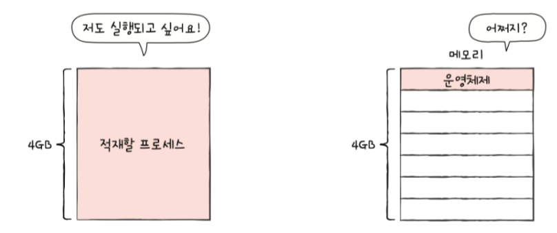
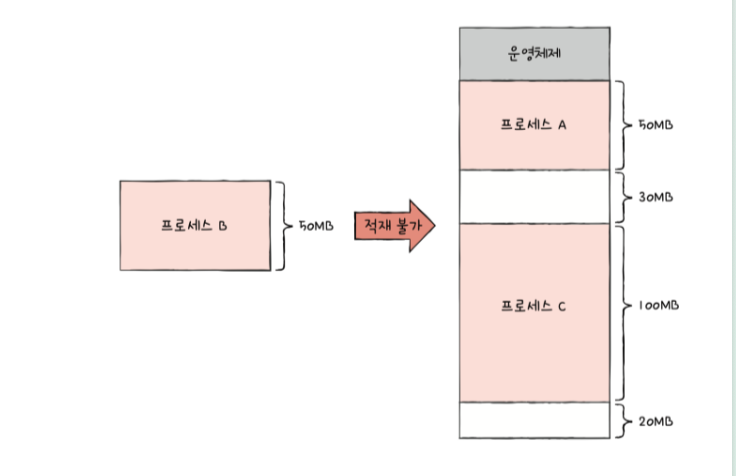
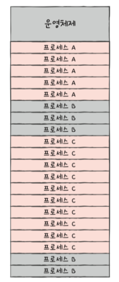
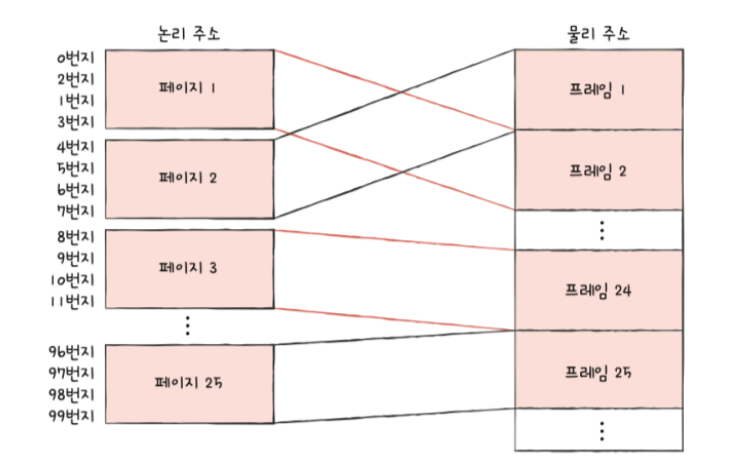

# 들어가며..
## 연속 메모리 할당의 두 가지 문제점
  - 외부 단편화
  - 물리 메모리보다 큰 프로세스 실행 불가

## 가상 메모리
  - 실행하고자 하는 프로그램을 일부만 메모리에 적재하여 실제 물리 메모리 크기보다 더 큰 프로세를 실행 할 수 있게 하는 기술
  -> 페이징, 세그멘테이션

## 페이징이란
- 외부 단편화가 발생했던 근본적인 문제?
- 각기 다른 크기의 프로세스가 메모리에 연속적으로 할당되었기 떄문

- 프로세스를 일정 크기로 자르고, 이를 메모리에 불연속적으로 할당할 수 있다면 어떨까?

### 페이징 (paging)
- 페이지를 프레임에 할당하는 가상 메모리 관리 기법
- 페이지: 프로세스의 논리 주소 공간 단위
- 프레임: 메모리의 물리 주소 공간 단위
- 장점: 외부 단편화 해결, 메모리 관리 효율성 증가
- 단점: 내부 단편화 발생 가능, 주소 변환 오버헤드

### 페이징 시스템에서의 스와핑
- 페이지 아웃 : 페이지를 메모리에서 보조기억장치로 이동
- 페이지 인 : 페이지를 보조기억장치에서 메모리로 이동