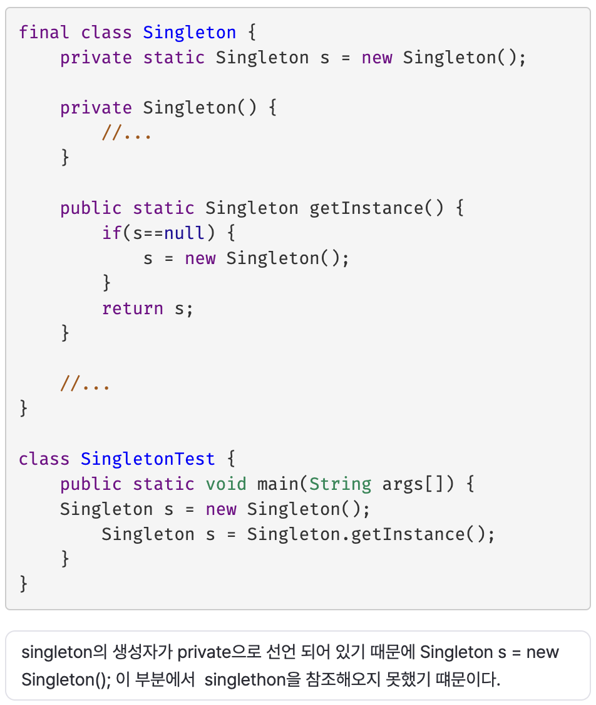

# [문제해결 04-03] 제어자

<aside>
👧🏻 public > protected > default > private

</aside>

# **제어자**

- 클래스, 변수 또는 메서드의 선언부에 함께 사용되어 부가적인 의미를 부여함
- 접근 제어자 : public, protected, default, private
- 그 외 : static, final, abstract, native, transient, synchronized, volatile, strictfp
- 제어자는 클래스나 멤버변수와 메서드에 주로 사용되며 하나의 대상에 대해서 여러 제어자를 조합하여 사용하는 것이 가능
- 단, 접근 제어자는 한 번에 네 가지 중 하나만 선택해서 사용할 수 있음, 하나의 대상에 대해서 public과 private을 함께 사용할 수 없음

## 기타 접근 제어자

### **static**

- 인스턴스변수는 하나의 클래스로부터 생성되었더라도 각기 다른 값을 유지하지만, 클래스변수는 객체에 관계없이 같은 값을 가짐, 모든 객체가 하나의 변수를 공유함
- 사용될 수 있는 곳 : 멤버변수, 메서드, 초기화 블럭

### **final 🔥**

- 마지막의, 변경될 수 없는 (const 개념!)
- 사용될 수 있는 곳 : 클래스, 메서드, 멤버변수, 지역변수
- 변수에 사용되면 값을 변경할 수 없는 상수, 메서드에 사용되면 오버라이딩 x, 클래스에 사용되면 자식클래스 정의 x

```jsx
class Card2 {
	final int NUMBER;		// 상수지만 선언과 함께 초기화 하지 않고
	final String KIND;		// 생성자에서 단 한번만 초기화할 수 있다.
	static int width  = 100;	
	static int height = 250;

	Card2(String kind, int num) {	
		KIND = kind;
		NUMBER = num;
	}

	Card2() {
		this("HEART", 1);
	}

	public String toString() {
		return KIND +" "+ NUMBER;
	}
}

class FinalCardTest {
	public static void main(String args[]) {
		Card2 c = new Card2("HEART", 10);
		c.NUMBER = 5;
		System.out.println(c.KIND);
		System.out.println(c.NUMBER);
		System.out.println(c); // System.out.println(c.toString());
	}
}
```

### **abstract**

- 메서드의 선언부만 작성하고 실제 수행내용은 구현하지 않은 추상 메서드를 선언하는데 사용됨
- 사용될 수 있는 곳은 클래스와 메서드
- 클래스 : 클래스 내에 추상 메서드가 선언되어 있음을 의미
- 메서드 : 선언부만 작성하고 구현부는 작성하지 않은 추상 메서드임을 알림

```java
abstract class at{
	abstract void move();
}
```

- 추상 클래스는 아직 완성되지 않은 메서드가 존재하는 '미완성 설계도'이므로 객체를 생성할 수 없음
- 이 클래스 자체로는 쓸모가 없지만 다른 클래스가 이 클래스를 상속받아서 일부의 원하는 메서드만 오버라이딩해도 된다는 장점이 있음

## **기본 접근 제어자**

- 멤버 또는 클래스에 사용되어, 해당하는 멤버 또는 클래스를 외부에서 접근하지 못하도록 제한하는 역할을 함
- 클래스나 멤버변수, 메서드, 생성자에 접근 제어자가 지정되어 있지 않다면, 접근 제어자가 default임을 뜻함
- 사용될 수 있는 곳 : 클래스, 메서드, 멤버변수, 생성자
- **public** : 접근 제한 x 어디서든 접근 가능
- **protected** : 같은 패키지 내에서, 다른 패키지의 자식클래스에서 접근 가능
- **default** : 같은 패키지 내에서만 접근 가능
- **private** : 같은 클래스 내에서만 접근 가능
- public > protected > default > private
- 클래스에 사용가능 : public, default
- 메서드, 멤버변수에 사용가능 : public, default, protected, private
- 지역변수에 사용가능 : X

### **접근 제어자를 사용하는 이유?**

- 외부로부터 데이터를 보호하기 위함
- 외부에는 불필요한, 내부적으로만 사용되는, 부분을 감추기 위함
- 데이터가 유효한 값을 유지하도록, 또는 비밀번호와 같은 데이터를 외부에서 함부로 변경하지 못하도록 하기 위해서는 외부로부터의 접근을 제한하는 것이 필요
- 데이터 감추기, 객체지향개념의 캡슐화
- 클래스 내에서만 사용되는 내부 작업을 위해 임시로 사용되는 멤버변수나 부분작업을 처리하기 위한 메서드 등의 멤버들을 클래스 내부에 감추기 위함
- 외부에서 접근할 필요가 없는 멤버들을 private으로 지정하여 외부에 노출시키지 않음으로써 복잡성 줄이며 이것 역시 캡슐화
- 메서드 하나를 변경해야 한다고 가정했을 때, 이 메서드의 접근 제어자가 public이라면 메서드를 변경한 후에 오류가 없는지 테스트해야하는 범위가 넓음, 그러나 접근 제어자가 default라면 패키지 내부만 확인해 보면 되고, private이면 클래스 하나만 살펴보면 됨
- 접근 제어자를 적절히 선택해서 접근 범위를 최소화하도록 노력해야함
    
    ```jsx
    public class TimeTest { 
          public static void main(String[] args) 
          { 
                Time t = new Time(12, 35, 30); 
                System.out.println(t); 
                t.hour = 13;
                t.setHour(t.getHour()+1);   // 현재시간보다 1시간 후로 변경한다. 
                System.out.println(t);      // System.out.println(t.toString());과 같다.
          } 
    }
    
    class Time { 
          private int hour; 
          private int minute; 
          private int second; 
    
          Time(int hour, int minute, int second) { 
                setHour(hour); 
                setMinute(minute); 
                setSecond(second); 
          } 
    
          public int getHour() { return hour; } 
          public void setHour(int hour) { 
                if (hour < 0 || hour > 23) return; 
                this.hour = hour; 
          } 
          public int getMinute() { return minute; } 
          public void setMinute(int minute) { 
                if (minute < 0 || minute > 59) return; 
                this.minute = minute; 
          } 
          public int getSecond() { return second; } 
          public void setSecond(int second) { 
                if (second < 0 || second > 59) return; 
                this.second = second; 
          } 
          public String toString() { 
                return hour + ":" + minute + ":" + second; 
          } 
    } 
    ```
    
- get으로 시작하는 메서드를 getter, set으로 시작하는 메서드를 setter라고 부름
- 멤버변수 hour는 0보다는 같거나 크고 24보다는 작은 범위의 값을 가져야 하지만 잘못된 값을 지정한다고 해도 이것을 막을 방법이 없음
- 멤버변수를 private이나 protected로 제한하고 멤버변수의 값을 읽고 변경할 수 있는 public 메서드를 제공함으로써 간접적으로 멤버변수의 값을 다룰 수 있도록 해야함

### **생성자의 접근 제어자**

- 생성자에 접근 제어자를 사용함으로써 객체의 생성을 제한할 수 있음
- 생성자의 접근 제어자를 private으로 지정하면 외부에서 접근할 수 없으므로 객체를 생성할 수 없게됨, 클래스 내부에서 생성할 수 있음
- 객체를 생성해서 반환해주는 public 메서드를 제공함으로써 객체 생성할 수 있게 해주고, 이 메서드는 public인 동시에 static이어야함
- 생성자가 private인 클래스는 다른 클래스의 부모가 될 수 없음 -> 자식클래스의 객체 생성 시 부모 클래스의 생성자를 호출해야만 하는데 private이므로 불가능 -> final 붙여서 상속할 수 없는 클래스라는 것을 알리는 게 좋음


*** 사용 가능한 제어자**

1. 클래스 : public, default, final, abstract

2. 메서드 : 모든 접근 제어자, final, abstract, static

3. 멤버변수 : 모든 접근 제어자, final, static

4. 지역변수 : final

*** 주의사항**

**1. 메서드에 static과 abstract를 함께 사용할 수 없음**

- static 메서드는 몸통이 있는 메서드에만 사용 가능

**2. 클래스에 abstract와 final을 동시에 사용할 수 없음**

- 클래스에 사용되는 final은 클래스를 확장할 수 없다는 의미, abstract는 상속을 통해서 완성되어야 한다는 의미이므로 모순

**3. abstract메서드의 접근 제어자가 private일 수 없음**

- 자식 클래스에서 구현해주어야 하는데 private이면 자식 클래스에서 접근 불가능

**4. 메서드에 private과 final을 같이 사용할 필요 없음**

- private인 메서드는 오버라이딩 될 수 없기 때문, 둘 중 하나만 사용해도 의미 충분
