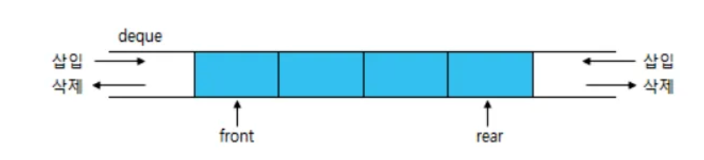

## **덱(Deque)**

**양쪽 끝에서 삽입과 삭제가 모두 가능한** 자료구조. 덱은 스택(Stack)과 큐(Queue)의 특징을 모두 가지고 있다.



## **덱(Deque)의 특징**

- 스택과 큐 자료구조를 혼합한 자료구조
- 스택이나 큐보다 입출력이 자유로운 자료구조
- 덱은 double-ended queue의 줄임말
- 전단(front)와 후단(rear)에서 모두 삽입과 삭제가 가능한 큐
- 데이터 중간의 삽입, 삭제 X
- 큐나 스택과 비슷한 연산들이 많음
- 스크롤(Scroll), 문서 편집기 등의 undo연산, 웹 브라우저의 방목 기록 등에 사용됨
- 파이썬의 리스트나 이중연결리스트로 구현 가능

## 덱(DEQUE) ADT

- **isEmpty()** : 덱이 비어있으면 true를 아니면 false를 반환한다.
- **isFull()** : 덱이 가득 차 있으면 true를 아니면 false를 반환한다.
- **Addfront(e)** : 맨 앞(전단)에 새로운 요소 e를 추가한다.
- **Deletefront()** : 맨 앞(전단)의 요소를 꺼내서 반환한다.
- **Getfront()** : 맨 앞(전단)의 요소를 꺼내지 않고 반환한다.
- **Addrear(e)** : 맨 뒤(후단)에 새로운 요소e를 추가한다.
- **Deleterear()** : 맨 뒤(후단)의 요소를 꺼내서 반환한다.
- **Getrear()** : 맨 뒤(후단)의 요소를 꺼내지 않고 반환한다.

### 요소 추가

- **Addrear(e)** : 맨 뒤(후단)에 새로운 요소e를 추가한다. ==enqueue
- **Deletefront()** : 맨 앞(전단)의 요소를 꺼내서 반환한다. ==dequeue
- **Getfront()** : 맨 앞(전단)의 요소를 꺼내지 않고 반환한다. ==peek

---

### 선형덱

```python
class Deque:
    def __init__(self):
        # 덱을 리스트로 구현
        self.deque = []

    def isEmpty(self):
        # 덱이 비어있으면 True, 아니면 False 반환
        return len(self.deque) == 0

    def isFull(self):
        # 리스트의 크기를 제한하지 않기 때문에 항상 False를 반환
        return False

    def addFront(self, e):
        # 맨 앞에 원소 추가
        self.deque.insert(0, e)

    def deleteFront(self):
        # 맨 앞의 원소를 꺼내 반환
        if not self.isEmpty():
            return self.deque.pop(0)
        else:
            print("덱이 비어있습니다.")
            return None

    def getFront(self):
        # 맨 앞의 원소를 반환 (꺼내지 않음)
        if not self.isEmpty():
            return self.deque[0]
        else:
            print("덱이 비어있습니다.")
            return None

    def addRear(self, e):
        # 맨 뒤에 원소 추가
        self.deque.append(e)

    def deleteRear(self):
        # 맨 뒤의 원소를 꺼내 반환
        if not self.isEmpty():
            return self.deque.pop()
        else:
            print("덱이 비어있습니다.")
            return None

    def getRear(self):
        # 맨 뒤의 원소를 반환 (꺼내지 않음)
        if not self.isEmpty():
            return self.deque[-1]
        else:
            print("덱이 비어있습니다.")
            return None

# 덱 생성
myDeque = Deque()

# 덱에 원소 추가
myDeque.addFront(1)
myDeque.addFront(2)
myDeque.addRear(3)
myDeque.addRear(4)

print("덱:", myDeque.deque)

# 맨 앞과 맨 뒤의 원소를 삭제하고 출력
print("deleteFront():", myDeque.deleteFront())
print("deleteRear():", myDeque.deleteRear())

print("덱:", myDeque.deque)

# 맨 앞과 맨 뒤의 원소를 반환 (꺼내지 않음)
print("getFront():", myDeque.getFront())
print("getRear():", myDeque.getRear())
```

### 원형덱

```python
class CircularDeque:
    def __init__(self, max_size):
        # 초기화: 덱을 나타내는 리스트, 덱의 크기, front와 rear 포인터, 최대 크기
        self.deque = [None] * max_size
        self.front = 0
        self.rear = 0
        self.size = 0
        self.max_size = max_size

    def isEmpty(self):
        # 덱이 비어있는지 확인
        return self.size == 0

    def isFull(self):
        # 덱이 가득 차 있는지 확인
        return self.size == self.max_size

    def addFront(self, e):
        # 맨 앞에 원소 추가
        if not self.isFull():
            self.front = (self.front - 1) % self.max_size
            self.deque[self.front] = e
            self.size += 1
            print('앞에서 추가:', e)
        else:
            print("덱이 가득 차 있습니다.")

    def deleteFront(self):
        # 맨 앞의 원소 삭제 및 반환
        if not self.isEmpty():
            front_value = self.deque[self.front]
            self.front = (self.front + 1) % self.max_size
            self.size -= 1
            return front_value
        else:
            print("덱이 비어있습니다.")
            return None

    def getFront(self):
        # 맨 앞의 원소 반환 (꺼내지 않음)
        if not self.isEmpty():
            return self.deque[self.front]
        else:
            print("덱이 비어있습니다.")
            return None

    def addRear(self, e):
        # 맨 뒤에 원소 추가
        if not self.isFull():
            self.deque[self.rear] = e
            self.rear = (self.rear + 1) % self.max_size
            self.size += 1
            print('뒤에서 추가:', e)
        else:
            print("덱이 가득 차 있습니다.")

    def deleteRear(self):
        # 맨 뒤의 원소 삭제 및 반환
        if not self.isEmpty():
            self.rear = (self.rear - 1) % self.max_size
            rear_value = self.deque[self.rear]
            self.size -= 1
            return rear_value
        else:
            print("덱이 비어있습니다.")
            return None

    def getRear(self):
        # 맨 뒤의 원소 반환 (꺼내지 않음)
        if not self.isEmpty():
            return self.deque[(self.rear - 1) % self.max_size]
        else:
            print("덱이 비어있습니다.")
            return None

# 덱 생성 (최대 크기: 5)
max_size = 5
myCircularDeque = CircularDeque(max_size)

# 덱에 원소 추가
myCircularDeque.addFront(1)
myCircularDeque.addFront(2)
myCircularDeque.addRear(3)
myCircularDeque.addRear(4)
myCircularDeque.addRear(5)

print("덱:", myCircularDeque.deque)

# 맨 앞과 맨 뒤의 원소를 삭제하고 출력
print("deleteFront():", myCircularDeque.deleteFront())
print("deleteRear():", myCircularDeque.deleteRear())
print("deleteRear():", myCircularDeque.deleteRear())
print("deleteRear():", myCircularDeque.deleteRear())

print("덱:", myCircularDeque.deque)

# 맨 앞과 맨 뒤의 원소를 반환 (꺼내지 않음)
print("getFront():", myCircularDeque.getFront())
print("getRear():", myCircularDeque.getRear())
```
