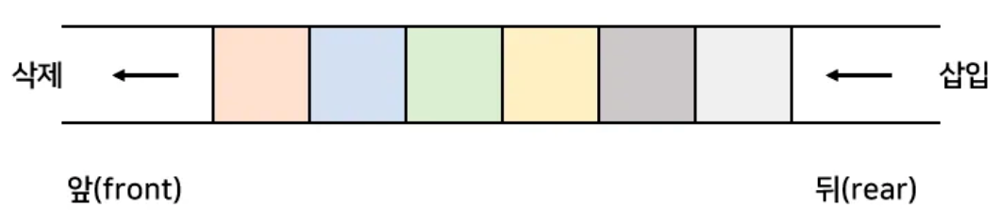

## 큐(QUEUE)

사전적 의미 : (무엇을 기다리는 사람, 자동차 등의) **줄** , 혹은 **줄을 서서 기다리는 것**


## 큐(Queue)의 특성

- 스택과 마찬가지로 **삽입과 삭제의 위치가 제한적인 자료구조**
    - 큐의 **뒤에서는 삽입**만 하고, 큐의 **앞에서는 삭제**만 이루어지는 구조
- **선입선출구조**(FIFO : First In First Out)
    - 큐에 삽입한 순서대로 원소가 저장되어, 가장 먼저 삽입(First in)된 원소는 가장 먼저 삭제(First Out)
- 기본적인 [자료](https://ko.wikipedia.org/wiki/%EC%9E%90%EB%A3%8C_%EA%B5%AC%EC%A1%B0) [구조](https://ko.wikipedia.org/wiki/%EC%9E%90%EB%A3%8C_%EA%B5%AC%EC%A1%B0)의 한가지
- 먼저 집어 넣은 [데이터](https://ko.wikipedia.org/wiki/%EB%8D%B0%EC%9D%B4%ED%84%B0)가 먼저 나오는 선입선출([FIFO](https://ko.wikipedia.org/wiki/FIFO) : First In First Out)구조로 저장하는 형식
- 나중에 집어 넣은 데이터가 먼저 나오는 스택과는 반대되는 개념

## 큐(QUEUE)의 종류

### 1. 선형 큐**(Linear Queue)**

- 큐의 맨 앞(첫 번째 요소) : front, 큐의 맨 뒤(마지막 요소) : rear
- enqueue : 큐의 rear에 요소 삽입
- dequeue : 큐의 front에 있는 요소 삭제
- isFull : 큐가 가득 찼는지
- isEmpty : 큐가 비었는지
- front : 큐의 front에 있는 값 출력(큐의 맨 앞)
- back : 큐의 rear에 있는 값 출력


### 선형 큐**(Linear Queue)의 특징**

- 정해진 리스트 배열 크기 내에서 각 인덱스를 front와 rear이 각각 한 번만 지나칠 수 있다.
- 데이터의 삽입 연산 enqueue() 가 일어나는 후단 rear 부분이 배열의 끝에 도달하면, 더 이상 배열을 사용할 수 없게 되는 구조
- 선형 큐에서는 rear가 배열 크기와 같아지면 큐가 꽉 찼다고 판단
- front와 rear가 동일한 위치를 가리키면 큐가 비었다고 판단


### 선형 큐**(Linear Queue)의 문제점**

- pop 수행 당시 데이터를 사용하고 해당 위치는 더 이상 접근하지도, 사용하지도 않는다. → 메모리 낭비
- 계속해서 데이터가 들어와야 한다면 더 큰 크기가 필요하며, 버려지는 공간도 계속해서 생길 것이다.

### 2. 원형 큐**(Circular Queue)**

- 큐의 시작과 끝이 이어져있어 효율적으로 사용할 수 있음.


기본 큐의 처음과 끝을 논리적으로 연결하여 오버플로 발생 보완


- 초기 상태 : **front = rear = 0** (=공백 상태), 최대 큐 사이즈 n
- 원형 큐의 enQueue : rear = (rear +1) % n
- 원형 큐의 deQueue : front = (front+1) % n


***원형 큐의 문제 : full, empty 상태일 때 front = rear (값이 같음)**

**→  해결하기 위해 front와 rear 사이에 하나의 공백을 둠.**

- **원형 큐의 포화 상태 : (rear+1)%n == front 이면 포화 상태**
- **원형 큐의 공백 상태 : front == rear 이면 공백 상태**
    
    

## 큐의 활용

- 우선순위가 같은 작업 예약 (프린터의 인쇄 대기열)
- 은행 업무
- 콜센터 고객 대기시간
- 프로세스 관리
- 너비 우선 탐색(BFS, Breadth-First Search) 구현

## 큐의 구현

```python
# 큐의 크기 지정
size = 23

# 큐 초기화
queue = [None] * size
front = rear = 0

# 큐가 비었는지 확인하는 함수
def isEmpty():
    return front == rear 

# 큐가 꽉 찼는지 확인하는 함수   
def isFull():   
    return (front == rear + 1) or (front == 0 and rear == size - 1)

# 큐에 원소 추가하는 함수
def enqueue(e):
    global rear
    if isFull():
        print("큐가 꽉 찼습니다")
    else:
        rear = (rear + 1) % size
        queue[rear] = e

# 큐에서 원소 제거하고 반환하는 함수
def dequeue():
    global front
    if isEmpty():
        print("큐가 비어 있습니다")
    else:
        front = (front + 1) % size
        return queue[front]

# 큐의 현재 내용을 리스트로 반환하는 함수
def getQueue():
    return queue[front + 1 : rear + 1]

# 큐의 크기를 반환하는 함수
def getSize():
    # 큐의 크기 계산. rear가 front보다 크면 단순히 빼주고, 그렇지 않으면 size를 더해줌
    return (size - front + rear) % size if rear >= front else (rear - front + size) % size

# 큐의 맨 앞 원소를 반환하지만 큐에서 제거하지 않는 함수
def peek():
    if isEmpty():
        print("큐가 비어 있습니다")
    else:
        return queue[(front + 1) % size]

# 큐의 모든 원소를 제거하는 함수
def clear():
    global front, rear
    front = rear = 0

# 큐의 맨 앞의 값을 반환하되 큐에서 제거하지 않는 함수
def getFront():
    if isEmpty():
        print("큐가 비어 있습니다")
    else:
        return queue[(front + 1) % size]

# 다양한 큐 작업 수행

# 큐에 원소 추가
enqueue(1)
enqueue(2)
enqueue(3)

# 큐의 맨 앞의 값을 확인
print("Front Element:", getFront())

# 큐의 크기 출력
print("Queue Size:", getSize())

# 큐 비우기
clear()
print("Cleared Queue")

# 다시 큐에 원소 추가
enqueue(4)
enqueue(5)
enqueue(6)

# 큐의 내용 출력
print("Queue Content:", getQueue())
```