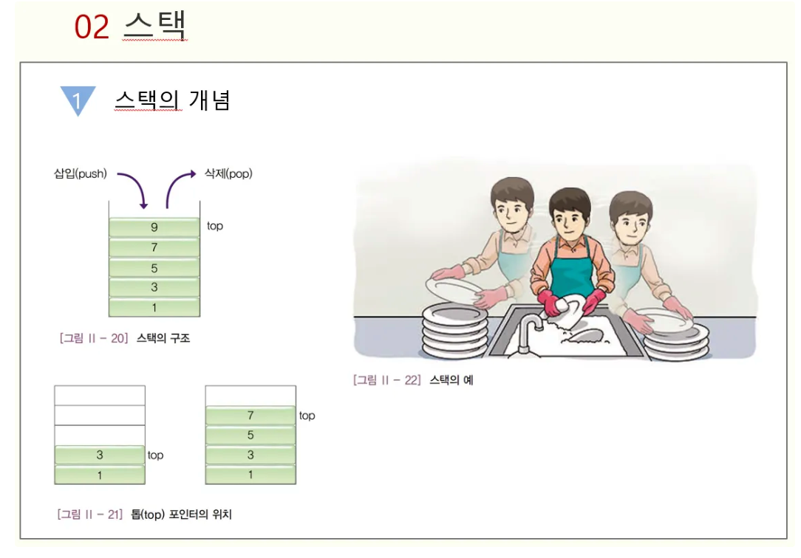

# 스택(Stack)이란?



### 개념

- 메모리의 스택 영역은 함수의 호출과 관계되는 지역변수, 매개변수, 리턴 값등의 임시데이터 저장.
- 스택이란 ‘차곡 차곡 쌓여진 더미’를 의미함.
- LIFO(Last In First Out, 후입선출) 구조

### 구조

- 데이터를 차곡차곡 쌓아 올링 형태
- 가장 마지막에 삽입 된 자료가 가장 먼저 삭제 됨.
- ex) 일회용 종이컵을 하나하나 꺼내서 사용하는 것.

### 활용 사례

- 웹 브라우저 방문 기록 (뒤로가기)
- 실행취소
- 역순 문자열
- 후위 표기법 계산

### **스택 용어**

- **스택 상단(top) :** 스택에서 입출력이 이루어지는 부분
- **스택 하단(bottom) :** 스택의 바닥 부분
- **요소(element) :** 스택에 저장되는 것
- **공백 스택(empty stack) :** 요소가 하나도 없는 스택

### 연산

- **create(size)** : 최대 크기가 size인 공백 스택 생성
- **is_full(s)** : 스택이 꽉 찼는지 확인하는 함수
    - 스택의 원소 수(top)가 size와 동일할 경우 return TRUE, 다를 경우 return FALSE
- **is_empty(s)** : 스택이 비어있는지 확인하는 함수
    - 스택의 원소 수(top)가 0일 경우 return TRUE, 0보다 클 경우 return FALSE
- **push(s, item)** :  스택을 추가하는 함수
    - is_full(s)을 실행하여 스택이 꽉 차있으면 에러를 발생시키고 빈 공간이 있을 경우 스택의 맨 위에 item 추가
- **pop(s)** : 스택 제거하는 함수
    - is_empty(s)를 실행하여 스택이 비어있으면 에러를 발생시키고 스택에 요소가 있으면 스택의 맨 위에 있는 요소를 제거하여 반환
- **peek(s)** : 가장 위에 있는 항목 반환하는 함수
    - is_empty(s)를 실행하여 스택이 비어있으면 에러를 발생시키고 스택에 요소가 있으면 스택의 맨 위에 있는 요소를 제거하지 않고 반환


### 오류 발생 조건


### 스택 구현

```python
class Stack:
    def __init__(self, stack_size):   
        self.stack = [None] * stack_size #스택 초기화 
        self.top = -1 

    def is_empty(self):
        return self.top == -1 # top이 -1이면 스택이 비어있음.

    def is_full(self):
        return self.top == len(self.stack) - 1 #배열 마지막 요소가 top과 같으면 꽉참

    def push(self, e): #요소 추가 함수
        if self.is_full(): # 꽉차서 못넣을 때 overflow출력
            print('overflow')
        else:
            self.top += 1 # 꽉 안 차있으면 top 위에 +1
            self.stack[self.top] = e

    def pop(self): # 요소 제거 함수
        if self.is_empty(): # 비어있어서 더이상 지울 요소가 없을 때 underflow출력
            print('underflow')
        else:
            e = self.stack[self.top] # 요소 제거 후 반환
            self.top -= 1
            return e

    def peek(self):
        if not self.is_empty():
            print(self.stack[self.top]) # 스택의 모든 요소 출력

    def get_min(self): # 스택의 모든 요소 중 가장 작은 요소 찾기
        if not self.is_empty():
            return min(self.stack[:self.top + 1])
    # 리스트 슬라이싱. 리스트 처음부터 self.top+1까지(현재요소 모두 포함)
        
    def get_max(self): # 스택의 모든 요소 중 가장 큰 요소 찾기
        if not self.is_empty():
            return max(self.stack[:self.top + 1])
        
    def get_sum(self): # 스택의 모든 요소를 다 더한 값 찾기
        if not self.is_empty():
            return sum(self.stack[:self.top + 1])
		
stack_size = 5
my_stack = Stack(stack_size)

my_stack.push(1)
my_stack.push(1)
my_stack.push(3)
my_stack.push(1)
my_stack.push(0)

print(my_stack.stack)
print('역순 출력:', my_stack.stack[::-1])
print('가장 작은 값:',my_stack.get_min())
print('가장 큰 값:',my_stack.get_max())
print('스택의 합:',my_stack.get_sum())
```