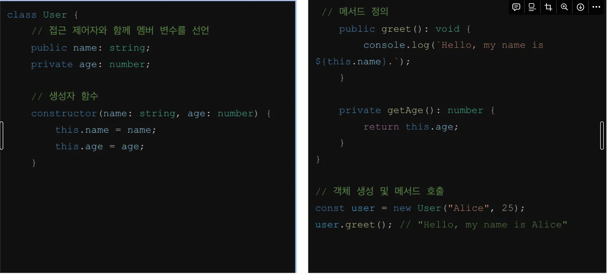

# # JavaScript

## px, em, rem

- px : 디지털 화면에 표시되는 가장 작은 단위
    - 절대값 사용
    - 고정된 물리적 크기
- em : 상대적인 단위
    - 부모 요소의 글꼴 크기에 따라 결정
- rem : 상대적인 단위, But HTML 문서 최상단 루트(root) 요소의 글꼴 크기에 기반
    - font-size 설정 X → 각 브라우저에 기본적으로 설정된 값 상속 (일반적으로 16px)

```css
<style>
  .container {
    font-size: 14px;
  }
  .container.title {
    font-size: 2em; // 28px
  }
  .container.subtitle {
    font-size: 1.5em; // 21px
  }
  .container.subtitle.leading {
    font-size: 0.5em; 
 }
</style> 
```

```css
html {
  font-size: 16px;
}

div {
  font-size: 20px;
  width: 10rem; /* 160px */
}
```

## vw, vh

- vw (viewport width), vh (viewport height)
    - 현재 실행중인 스크린에 맞춰 상대적 크기 반환
    - 열려있는 화면 전체의 상대 길이이기 때문에 스크롤 바를 포함한 길이를 반환
    - 브라우저 높이값과 너비 값의 100분의 1단위
        - 예) 높이값 900px, 너비가 750px → 9vh, 7.5vw

```css
div {
    width: 25vw;
    height: 50vh;
}
```

# CSS 애니메이션 vs JS 애니메이션

### CSS 애니메이션

- 간결함: 주로 스타일시트에서 정의되며, 간결한 문법
- 성능 최적화: 브라우저는 CSS 애니메이션을 GPU 가속으로 최적화
- 제한된 제어: 복잡한 인터랙션이나 동적 애니메이션에는 적합하지 않음
- 구현 방식: `@keyframes` 를 사용해 애니메이션을 정의하고, animation 속성을 사용해 이를 요소에 적용

```css
<style>
       .box {
           width: 100px;
           height: 100px;
           background-color: red;
           position: relative;
           animation: moveAndColor 2s infinite alternate;
       }
       @keyframes moveAndColor {
           0% {
               left: 0;
               background-color: red;
           }
           100% {
               left: 300px;
               background-color: blue;
           }
       }
   </style> 
```

### JavaScript 애니메이션

- 유연성: 복잡한 인터랙션과 동적인 효과 구현에 적합
- 세밀한 제어: 애니메이션의 시작, 중지, 진행 중 상태를 세밀하게 제어
- 추가적인 코드: 추가적인 JavaScript 코드가 필요
- 구현 방식: `setInterval`, `requestAnimationFrame` 등의 메서드를 사용해 직접 애니메이션을 작성하거나, GSAP 등의 라이브러리 활용

```css
<script>
       const box = document.getElementById('box');
       let position = 0;
       let direction = 1;
       let colorToggle = true;
       function animate() {
           position += 2 * direction;
           if (position >= 300 || position <= 0) {
               direction *= -1; // 방향 전환
               colorToggle = !colorToggle; // 색상 전환
           }
           box.style.left = position + 'px';
           box.style.backgroundColor = colorToggle ? 'red' : 'blue';
           requestAnimationFrame(animate);
       }
       animate(); // 애니메이션 시작
   </script>
```

### requestAnimationFrame

- 브라우저에서 애니메이션을 최적화하여 실행하기 위해 제공하는 API
- 이 함수는 브라우저가 다음 화면을 다시 그리기 전에 특정 함수(콜백)를 호출하도록 예약
- 이 방법은 애니메이션이 화면의 새로 고침 속도(보통 60fps)에 맞춰 실행(모니터 주사율 맞춤)
- 시스템이 프레임을 그릴 준비가 되면 애니메이션 프레임을 호출
- 주요 특징
    - 자동 최적화: 브라우저는 애니메이션의 성능을 최적화하여 CPU나 GPU의 리소스를 적절히 사용할 수 있도록 제어
    - 화면 재도 기준: 브라우저의 리페인트(화면 다시 그리기) 타이밍에 맞춰 애니메이션이 실행되므로, 부드러운 애니메이션을 구현
    - 중단과 재개: 브라우저 탭이 비활성화된 상태에서는 애니메이션이 자동으로 중단되며, 다시 활성화될 때 재개됨. 이는 리소스 절약에 도움이 됩니다.

# **Attribute vs Property**

### **Attribute** : HTML 요소에 정의된 초기 설정값

- 속성은 **문자열**로 저장되며, 언제나 HTML 코드에 있는 그대로 반영됨
- 브라우저는 이 속성 값을 읽어서 DOM 요소를 만듦
- `<input value="hello">`
- 정적

### **Property :** DOM의 객체 속성, JavaScript에서 동적으로 접근하거나 변경할 수 있음

- 다양한 데이터 타입을 가짐
- 데이터 타입에 따라 동적으로 값이 변할 수 있으며, 점표기법으로 접근(e.g., element.propertyName).
- `input.value = "world”`
- 동적

### 차이점

- HTML의 Attribute는 DOM에 로드되면서 Property로 매핑
- 그 이후 Property는 DOM 상에서 동적으로 변화 가능

# **클로저**

- 렉시컬 스코프(=자신이 선언된 당시의 환경)을 기억하는 함수
    - 생명 주기가 끝난 이후에도 외부 함수의 변수에 접근할 수 있는 내부 함수

```jsx
function outerFunc() {
    var x = 10; // outerFunc에 의해 생성된 지역 변
    var innerFunc = function () { // 내부 함수 = 클로저
      console.log(x); // 부모 함수에서 선언된 변수를 사용
    };
    return innerFunc;
  }
  var inner = outerFunc();
  inner(); // 10
```

# 렉시컬 스코프

- 함수나 변수가 정의된 위치에 따라 결정된 스코프 범위
- **변수가 어디에서 정의되었는지를 기준으로 그 변수가 어떤 범위에서 접근 가능한지를 결정**

```jsx
// 전역에 변수를 선언하면 이 변수는 어디서든지 참조할 수 있는 "전역 스코프"를 가지는 전역 변수가 된다
var x = 1; //global

function first() {
  var x = 10;  // first 함수 안에서만 사용되는 지역 변수
  second();    // second 함수를 호출
}

function second() {
  console.log(x);  // x 값을 출력
}

first();  // 1
second(); // 1
```

# # TypeScript

## 기본 데이터 타입

- `number` : 숫자 타입으로, 정수와 실수를 포함
- `string` : 문자열 타입
- `boolean` : 참과 거짓을 나타내는 불리언 타입
- `null` : 값이 없음을 나타내는 타입
- `undefined` : 값이 할당되지 않은 변수의 기본값인 타입

## 객체 타입

- `object` : 객체를 나타내는 타입을 정의하려면, 타입 주석을 사용하여 객체의 속성과 해당 속성의 데이터 타입을 명시하면 됨. 객체의 데이터 타입을 지정하는 것은 개발자가 코드를 더 명확하게 이해하고, 에러를 줄이는 데 도움이 됨.
    
    ```jsx
    const user : {name:string, age:number} = {
    	name: "minji",
    	age: 18
    };
    ```
    
- `array` : 동일한 타입의 요소를 가진 배열을 나타내는 타입
    
    ```jsx
    // 1
    let arr1:number[] = [1,2,3];
    
    // 2
    let arr2:Array = [1,2,3];
    ```
    
- `tuple` : 각 요소가 다른 타입을 가질 수 있는 배열을 나타내는 타입
    
    tuple은 고정된 길이와 타입의 배열입니다. 각 요소의 타입과 순서가 정해져 있습니다. 이는 javaScript에는 없는 데이터 타입이며 TypeScript에서만 제공됩니다
    
    ```jsx
    let tuple: [string, number, boolean] = ['Hello','42',true];
    ```
    

## 특수 타입 (TS전용)

- `any` : 어떠한 타입이든 할당될 수 있는 타입
    
    ```jsx
    // any 타입을 사용하면, 변수에 뭐든 넣을 수 있지만, 타입스크립트는 그 변수에 뭐가 들어있는지 확인하지 않아요.
    // 어떤 값이든 넣을 수 있음!
    let value: any; 
    
    value = "Hello";
    value = 42;
    value = true;
    
    // any 타입은 어떤 메서드도 호출할 수 있습니다.
    // 불리언에는 이런 함수가 존재 X
    value.toUpperCase(); // 런 타임 오류 발생 가능성 있음, 타입 체크 없음
    ```
    
- `unknown` : 타입을 미리 알 수 없는 경우에 사용 되는 타입.  이 타입은 안전한 타입 검사를 위해 사용 됨.
    
    ```jsx
    let value: unknown;
    
    value = "Hello";
    value = 42;
    value = true;
    
    // unknown 타입은 사용하기 전에 반드시 타입 체크를 해봐야합니다.
    if (typeof value === "string") {
    	console.log(value.toUpperCase()); // 타입이 String인 경우에만 안전하게 사용 가능
    } 
    
    // 오류 발생 : unknown 타입에서는 메서드르 바로 호출할 수 없습니다. (아래 코드 실행 시)
    // 타입 체크 없이 바로 value.toUpperCase()를 호출하면 오류가 발생해요.
    // 이유는 간단해요. unknown 타입은 어떤 타입인지 모르기 때문에, 타입을 확인하기 전까지는 메서드를 호출할 수 없어요.
    // value가 문자열인지, 숫자인지, 불리언인지 모르는 상태에서 문자열 메서드를 쓰려고 하니까, 오류가 나는 거예요.
    ```
    
- `never` : 절대 발생하지 않는 값의 타입을 나타냄. 예를 들어 함수가 항상 예외를 발생시키거나 무한 루푸를 실행할 떄 이 타입을 사용할 수 있음.
    
    ```jsx
    function throwErrror(message: string): never {
    	throw new Error(message);
    }
    
    function infiniteLoop(): never {
    	while (true) {
    		// 무한 루프
    	}
    }
    
    // 타입 시스템에서 예상치못한 상태를 처리하기
    type Action = {type: "start" } | {type: "stop" };
    
    function handleAction(action: Action) {
    	switch (action.type) {
    		case "start":
    			console.log("Starting..");
    			break;
    		case "stop":
    			console.log("Stoping..");
    			break;
    		default:
    			const _exhaustiveCheck: never = action; // 모든 케이스가 처리되었는지 확인
    			// 여기서 컴파일러 오류를 발생시키게 하비낟. 만약 Action 타입이 변경되었는데, 
    			break;
    		}
    }
    ```
    

# TypeScript에서 함수의 데이터 타입

TypeScript에서 함수를 사용할 때, 매개변수와 반환 값에 대한 데이터 타입을 지정할 수 있습니다. 이를 통해 코드의 안정성과 가독성이 높아집니다. 이번 예제에서는 간단한 함수를 작성하고, TypeScript를 사용해 데이터 타입을 지정해보겠습니다

```jsx
function add(a: number, b: number): number {
	return a + b
}
```

위 예제에서 함수 add는 두 개의 숫자를 매개변수로 받고, 두 숫자의 합을 반환합니다. 각 매개변수와 반환 값에 데이터 타입을 지정해주었습니다.

함수에서 일부 매개변수는 선택적으로 받을 수 있게 만들고 싶을 떄, 매개변수 뒤에 '?'를 사용합니다. 이렇게 하면 해당 매개변수는 선택적이 되어, 값을 전달하지 않아도 됩니다.

```jsx
function greet(name: string, greeting?: string): string {
	if (greeting) {
		return `${greeting), ${name}!`;
	} else {
		return `Hello, ${name}!`;
	}
}
```

## unknown 타입 활용한 isString 함수 구현

`isString`이라는 타입 가드를 작성하고, 이 타입 가드를 사용하여 unknown 타입의 입력이 문자열인 경우에만 특정 동작을 수행하는 함수를 만드세요.

1. `isString` 함수는 입력값이 문자열인지 확인하여, 그 결과를 불리언으로 반환합니다.
2. `processInput` 함수는 `input`을 매개변수로 받아, 이 값이 문자열인 경우에만 해당 문자열을 대문자로 변환하여 출력합니다. 문자열이 아닌 경우에는 "Not a string"이라는 메시지를 출력합니다.

```jsx
function isString(value: unknown): value is string {
    return typeof value == 'string';
}

function processInput(input: unknown): void {
    if (isString(input)) {
        console.log(input.toUpperCase());
    } else {
        console.log("Not a string");
    }
}

processInput("hello");  // "HELLO"
processInput(123);      // "Not a string"
```

# tsconfig.json


- **target**: 컴파일된 코드가 어떤 환경에서 실행될 지 정의, 컴파일후 어떤 버전의 JavaScript 버전으로 변환할 지 결정
- **strict**: 모든 타입 체킹 옵션을 활성화한다는 것을 의미
- **lib**: 컴파일러가 지원할 JavaScript API 및 타입 정의를 선택, 사용할 수 있는 타입과 전역 객체 선택
- **outDir**: 컴파일된 파일들이 저장되는 경로 지정

# 배열

```jsx
// 숫자 배열
let list1 : number [] = [1,2,3,4,5]
console.log(list1);

// 유니온 타입 배열
// 유니온 타입 : 2개 이상의 타입을 허용하는 경우
let list2 : (string | number | boolean | null) [] = ['lee', 10, true, null];
console.log(list2)

// 재네릭타입 배열
// 타입을 변수화한것.
let a : Array<string>;
a = ['a', 'b'];
console.log(a);

let arr: Array<(x:number, y:number) => number> = [(x,y) => x+y, (x,y) => x-y]
arr.forEach((f) => console.log(f(4,2)));
```

# interface

```jsx
// 사용자 인터페이스 정의
interface User {
   id: number;
   name: string;
   email: string;
   isActive: boolean;
   // 메서드를 정의할 수도 있음
   getDisplayName(): string;
}

// 함수에서 User 인터페이스 사용
function printUserInfo(user: User): void {
   console.log(`User Info: ${user.getDisplayName()} (${user.email})`);
}

// User 인터페이스를 준수하는 객체
const user: User = {
   id: 1,
   name: "Alice",
   email: "alice@example.com",
   isActive: true,
   getDisplayName(): string {
       return `${this.name} (${this.isActive ? "Active" : "Inactive"})`;
   }
};

// 사용자 정보 출력
printUserInfo(user);  // 출력: User Info: Alice (Active) (alice@example.com)

```

# **class**


# [문제해결05-02] 도형 클래스 만들기

```jsx
interface Shape {
  getArea(): number;
}

class Circle {
  radius: number; // 멤버 변수 radius 값을 설정합니다.
  constructor(radius: number) {
    this.radius = radius;
  }
  getArea(): number {
    return Math.PI * this.radius * this.radius;
  }
}
class Rectangle {
  width: number;
  height: number;
  constructor(width: number, height: number) {
    this.width = width;
    this.height = height;
  }
  getArea(): number {
    return this.width * this.height;
  }
}
const shapes: Shape[] = [new Circle(5), new Rectangle(10, 5)];
shapes.forEach((shape) => {
  console.log(shape.getArea().toFixed(2));
});
```

# **interface 와 class :  실무에서의 활용**

1. **API** 
2. 수 있음.

# My post

```jsx
<!DOCTYPE html>
<html lang="en">

<head>
  <meta charset="UTF-8">
  <meta name="viewport" content="width=device-width, initial-scale=1.0">
  <title>Post Viewer</title>
  <link rel="stylesheet" href="css/style.css">
</head>

<body>
  <div id="posts-container" class="posts-container">
  </div>
  <script src="dist/showContents.js" defer></script>
</body>

</html>
```

```jsx
interface Post {
  id: number;
  title: string;
  body: string;
  userId: number;
  userName?: string; // 사용자 이름 속성 추가
}
// API에서 게시글 데이터를 가져오는 함수
async function fetchPosts(): Promise<Post[]> {
  const response = await fetch("https://jsonplaceholder.typicode.com/posts");
  if (!response.ok) {
      throw new Error("Failed to fetch posts");
  }
  const posts: Post[] = await response.json();

  // 각 게시글에 해당하는 userId로 사용자 이름을 가져와 추가
  for (let post of posts) {
      const userResponse = await fetch(`https://jsonplaceholder.typicode.com/users/${post.userId}`);
      if (userResponse.ok) {
          const user = await userResponse.json();
          post.userName = user.name; // 사용자 이름 추가
      }
  }

  return posts;
}

// 게시글 데이터를 렌더링하는 함수
function renderPosts(posts: Post[]): void {
  const postsContainer = document.getElementById("posts-container");

  if (!postsContainer) return;

  postsContainer.innerHTML = "";  // 이전 내용을 지우기

  posts.forEach(post => {
      const postElement = document.createElement("div");
      postElement.className = "post";

      const titleElement = document.createElement("h2");
      titleElement.textContent = post.title;

      const userElement = document.createElement("h3");
      userElement.textContent = `by ${post.userName}`; // 사용자 이름 표시

      const bodyElement = document.createElement("p");
      bodyElement.textContent = post.body;

      postElement.appendChild(titleElement);
      postElement.appendChild(userElement); // 사용자 이름 추가
      postElement.appendChild(bodyElement);
      postsContainer.appendChild(postElement);
  });
}

// 데이터를 가져와서 렌더링하는 메인 함수
async function displayPosts(): Promise<void> {
  try {
      const posts = await fetchPosts();
      renderPosts(posts);
  } catch (error) {
      console.error("Error fetching and rendering posts:", error);
  }
}

// 함수 호출
displayPosts();

```

```jsx
interface Post {
    /* (가)  id, title, body */
}

// API에서 게시글 데이터를 가져오는 함수
async function fetchPosts(): /* (나)   */  {
    const response = await fetch("https://jsonplaceholder.typicode.com/posts");
    if (!response.ok) {
        throw new Error("Failed to fetch posts");
    }
    const posts: /* (다)   */  = await response.json();
    return posts;
}

// 게시글 데이터를 렌더링하는 함수
function renderPosts(/* (라)   */ ): /* (마)   */  {
    const postsContainer = document.getElementById("posts-container");

    if (!postsContainer) return;

    postsContainer.innerHTML = "";  // 이전 내용을 지우기
   
    posts.forEach(post => {
        const postElement = document.createElement("div");
        postElement.className = "post";

        const titleElement = document.createElement("h2");
        titleElement.textContent = post.title;

        const bodyElement = document.createElement("p");
        bodyElement.textContent = post.body;

        postElement.appendChild(titleElement);
        postElement.appendChild(bodyElement);
        postsContainer.appendChild(postElement);
    });
}

// 데이터를 가져와서 렌더링하는 메인 함수
/* (바)   */  function displayPosts(): /* (아)   */  {
    try {
        const posts = await fetchPosts();
        renderPosts(posts);
    } catch (error) {
        console.error("Error fetching and rendering posts:", error);
    }
}

// 함수 호출
displayPosts();
```

# **타입 확장 - 유니온 타입**

- 타입확장: 중복되는 타입 선언 줄이기 위함. extends 외에도 |, & 기호를 이용해서 유니온 타입, 교차 타입을 사용
- 유니온 타입 : 여러 타입 중 하나를 허용할 수 있는 타입을 정의할 때 사용 ‘|’ 기호 사용
- 유니온 타입은 유니온 타입에 포함된 모든 타입이 공통으로 가지고 있는 속성에만 접근함
- 모든 속성을 가진 단일 타입
- ‘&’ 기호 사용
- 유니온 타입과 교차 타입을 사용한 새로운 타입은 오직 type 키워드로만 선언할 수 있음

```jsx
let id: number | string;

id = 101; // number 타입
id = "A101"; // string 타입
// id = true; // 오류 발생 : 'boolean' 타입은 'number | string'에 할당 될 수 X

function printId (id: number | string) {
	console.log (`ID: ${id}`);
}

printId(123); // 출력 : ID : 123
printId("ABC123"); // 출력: ID: ABC123

function getLength(value: string | number): number {
    if (typeof value === "string") {
        // value가 string 타입인 경우
        return value.length;
    } else {
        // value가 number 타입인 경우
        return value.toString().length;
    }

    console.log(getLength("hello"));  // 출력 : 5
    console.log(getLength(12345)); // 출력 : 5

    let mixedArray: (number | string)[] = [1, "two", 3, "four"];

    mixedArray.push(5);  // 배열에 number 타입 요소 추
    mixedArray.push("six"); // 배열에 string 타입 요소 추가
    // mixedArray.push(true);
    // 오류 발생 : 'boolean' 타입은 'number | string'에 할당될 수 X
}
```


x.tip 의 타입은 never

# interface아 type의 차이점 코드 및 설명


## 차이점

```jsx
interface는 extends 키워드를 사용하여 상속을 구현합니다
interface Shape {
color: string;
}

interface Square extends Shape {
sideLength: number;
}
```

```jsx
type은 인터섹션 타입(&)을 사용하여 타입을 결합합니다.

type Shape = {
	color: string;
}

type Square = Shape & {
sideLength: number;
}
```

- type은 유니언 타입, 튜플, 그리고 원시 타입 등 다양한 타입을 표현할 수 있지만, interface는 객체의 구조를 정의하는 데 주로 사용됩니다.
- interface는 나중에 선언된 부분에서도 추가 확장이 가능합니다.

```jsx
interface Shape {
color: string;
}

interface Shape {
border: number;
}

위 처럼 동일 이름의 인터페이스를 재정의하면서 속성을 추가할 수 있습니다. 반면 type은 중복 정의가 불가능합니다.
```

# 타입좁히기

- A is B (A가 B일 때만)

```tsx
type DestinationCode = "A" | "B" | "C";
//const testCodeList: DestinationCode [l = [ "B", "C", "D", "E", "F", "G"]
const testCodeList = ["B", "C", "D", "E", "F", "G"];
const destinationCodeList = ["A", "B", "C"];
const isDestinationCode = (x: string): x is DestinationCode =>
  destinationCodeList.includes(x);
testCodeList.map((item) => {
  if (isDestinationCode(item)) {
    console.log(item);
  }
});

```

- null, undefined를 검사하는 함수에 응용

```jsx
function checkNonNullable<T>(value: T): value is NonNullable<T> {
  return value !== null && value !== undefined;
}

const a = null;
const b: string = "hello";
if (checkNonNullable(a)) {
  console.log(a);
} else if (checkNonNullable(b)) {
  console.log(b);
}
```


# **[문제해결06-02] 타입가드 활용해서 유니온 타입의 타입 좁히기( isNumber, isString )**

```jsx
function printId(id: number | string) {
  if (typeof id === "string") {
    console.log(id.toUpperCase());
  } else if (typeof id === "number") {
    console.log(id.toFixed(2));
  }
}

printId('hello');
printId(234.2334); 

```

```jsx
function printId(id: number | string) {
   // string : uppercase
     // number : 소수 자리 둘째자리 출력
}

```

# ?. (Optional Chaining) 연산자 - 객체 접근 예제

- 장점
    - 코드 간소화: 중첩된 객체 구조에서 반복적인 null 또는 undefied 확인 코드가 줄어들어 가독성 향상
    - 안정성 : 예상치 못한 `null` 또는 `undefined` 값으로 인한 런타임 오류 예방
    - 유연성 : 다양한 형태의 객체 구조에서 쉽게 적용 가능, 메서드 호출, 배열 인덱스 접근, 프로퍼티 접근 등 여러 경우에 시용
- 메서드 호출

```tsx
type Logger = {
  log?: (message: string) => void;
};

const logger: Logger = {
  log: (message) => console.log(message),
};

logger.log?.("Logging this message."); // "Logging this message." 출력

const noLogger: Logger = {};

noLogger.log?.("This won't be logged."); // 오류 없이 그냥 무시됨

```

# **[문제해결06-03] 코드의 오류를 수정하라. ( in 연산자 사용)**

```jsx
type Fish = { swim: () => void };
type Bird = { fly: () => void };
type Human = { swim?: () => void; fly?: () => void };

function move(animal: Fish | Bird | Human) {
  if ('swim' in animal) {
    animal.swim?.(); // swim이 존재하는지 확인 후 안전하게 호출
  } else if ('fly' in animal) {
    animal.fly?.(); // fly가 존재하는 경우 안전하게 호출
  }
}

let f: Fish = { swim: () => console.log('swimming') };
move(f); // "swimming"
```

```jsx
type Fish = { swim: () => void }
type Bird = { fly: () => void }
type Human = { swim?: () => void; fly?: () => void }

function move( animal : Fish | Bird | Human ){
    animal.swim();
}

let f : Fish = { swim : () => console.log('swimming')};
move(f);
```

# Class

