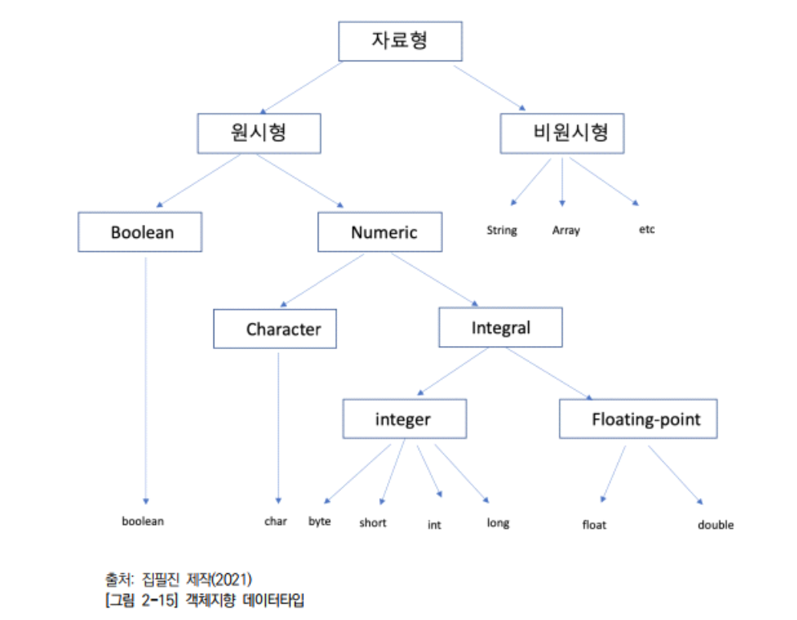

# 프로그래밍 언어 활용

 구조적 프로그래밍 설계 구조 및 절차
구조적 프로그래밍은 구조화 프로그래밍으로도 불리며 절차적 프로그래밍
기반 아래 만들어진 프로그래밍 기법으로 프로그램을 결합하는 순차, 분기,
반복 구조를 통하여 설계된다.

## 1. 구조적 프로그래밍 설계 구조
1. 순차구조
2. 선택구조(if, if-else)
3. 반복구조 (for, while)

## 2. 구조적 프로그래밍 언어 개발 절차
1. 요구사항 분석
2. 구조적 분석
3. 구조적 설계
4. 구조적 프로그래밍
  * 데이터 흐름도 DFD(Data Flow Diagram)
    1. 프로세스
      - 데이터 흐름(Data Flow)
      - 데이터 저장소(Data Store)
      - 외부 엔티티(External Entity)
    2. DFD 설계 방법
      1. 업무를 분석하여 프로세스에 대한 입출력 데이터 흐름을
식별한다. 이후 업무의 주변 경계에 그들을 표시한다.
      2. 데이터 흐름에 필요하고 제공되어야 할 외부 엔티티를 정의한다.
      3. 입력으로부터 출력으로나 출력으로부터 입력으로, 중간 지점부터의
데이터 흐름을 식별한다.
      4. 모든 접속 관계 데이터 흐름에 명칭을 부여한다.
      5. 프로세스에 대해 입력 데이터와 출력 데이터 흐름의 명칭에 따라
      이름을 부여한다.
      6. 프로세스에 관련된 데이터 저장소를 정의하고 검토, 보완한다.
      7. 상위 레벨 DFD 작성 후 다음 하위 레벨의 DFD로 분할하여 최하
      위 레벨까지 그린다.
      8. 데이터 흐름도의 규모가 커서 한 장의 종이에 그릴 수 없을 때는
      시스템을 서브 시스템들로 분할한다. 분할된 서브시스템들의 규모가 클
      때는 다시 분할을 계속한다. 세분화를 계속하여 최종 데이터 흐름도를
      단순한 기능들만으로 그릴 수 있는 단계까지 분할한다.
  * 자료사전 DD(Data Dictionary)
  * 상태 전이도 STD(State Transition Diagram)
  * 소단위 명세 Minispec(Mini Specification)

## 1-2 구조적 프로그래밍 언어 활용
1. 절차식 언어
  - 위에서 아래로 순서대로 실행
2. 명령어 언어
3. 함수 중심 언어
### 구조적 프로그래밍 유형
- c언어
- 파스칼
- 에이다
### 주요 구현 언어 문법
- 조건문(if, if~else, switch)
- 반복문 (for, while)

## 2. 객체지향 프로그래밍 언어 활용
### 객체 지향 설계 원칙의 이해
- 객체 지향 속성
  - 캡슐화
  - 추상화
  - 다형성
    - 오버로딩
    - 오버라이딩
  - 정보 은닉
  - 상속성
### 2. 객체지향 설계 원칙
1. 단일 책임 원칙 (Single Responsiblity Principle)
- 모든 클래스는 각각 하나의 책임만 가져야 한다.
- 클래스는 그 책임을 완전히 캡슐화해야 함을 말한다.
2. 개방-폐쇄 원칙 (Open Closed Principle)
- 확장에는 열려 있고 수정에는 닫혀 있어 기존의 코드를 변경하지 않고
(Closed), 기능을 추가할 수 있도록(Open) 설계가 되어야 한다는 원칙을
말한다.
3. 리스코프 치환 원칙 (Liskov Substitution Principle)
- 자식 클래스는 자신의 부모 클래스를 대체할 수 있다는 원칙이다.
- 부모 클래스가 들어갈 자리에 자식 클래스를 넣어도 잘 작동해야 한다. 자식
클래스는 부모 클래스의 책임을 무시하거나 재정의하지 않고 확장만 수행 하도록 해야 만족한다.
4. 인터페이스 분리 원칙 (Interface Segregation Principle)
- 한 클래스는 자신이 사용하지 않는 인터페이스는 구현하지 말아야 한다는
원칙이다. 하나의 평범한 인터페이스보다 여러 개의 구체적인 인터페이스
가 좋다.
5. 의존 역전 원칙 (Dependency Inversion Principle)
- 의존 역전 원칙은 변화가 없는 것에 의존해야 한다는 원칙이다. 구체적인
클래스보다 인터페이스나 추상 클래스와 관계를 맺어야 하는 원칙이다
## 객체지향 프로그래미 언어 구성 요소
- 클래스
- 객체
- 메소드
- 속성
### 접근지정자
1. public
- 모든 접근을 허용하는 접근자로 공개적으로 오픈할 때 사용하는 접근자이다
2. protected
- 자기 자신 클래스 및 상속받은 자식 클래스에서의 접근을 허용하는 접근
자이다.
3. private
- 자기 자신 클래스 내부의 메소드만 접근을 허용하는 접근자이다.
4. default
- 접근 지정자를 명시하지 않는 경우이다. 같은 패키지에서는 모두 접근 가
능하지만 다른 패키지일 때는 접근이 불가능하다.

## 데이터 타입

## 변수와 메소드
- 접근제어자: 변수의 접근 범위를 지정한 것으로 public, private,
protected, defalut 등을 이용할 수 있다.
- 타입: 자료형으로 명시적으로 타입을 지정한 것으로 사용할
수 있는 데이터형을 선언하는 곳이다.
### 변수 유형
- 멤버 변수(Member Variable)
  - 클래스부에 선언된 변수들로 객체의 속성에 해당하고, 인스턴스 변수와
클래스 변수로 구분된다.
- 인스턴스 변수(Instance Variable)
  - 클래스가 인스턴스될 때 초기화되는 변수로서 인스턴스를 통해서만 접
근할 수 있다.
- 매개 변수(Parameter)
  - 매개 변수는 메소드에 인자로 전달되는 값을 받기 위한 변수로서 메소
드 내에서는 지역변수처럼 사용된다.
- 지역변수(Local Variable)
  - 메소드 내에서 선언된 변수로서 멤버 변수와 동일한 이름을 가질 수 있
으며 지역적으로 우선일 때 사용하게 된다.
- 클래스 변수(Class Variable)
  - static으로 선언된 변수로, 인스턴스 생성 없이 클래스 이름의 변수명으
로 사용 가능하고, main() 메소드에서 참조 가능하다.

## 디자인 패턴 구조
1. 콘텍스트
2. 문제
3. 해결
### 디자인 패턴의 종류
1. GoF 다자인 패턴
  - 생성, 구조, 행위 3가지로 분류

## 스크립트 언어
스크립트 언어(Scripting Language)는 응용소프트웨어를 제어하는 컴퓨터
프로그래밍 언어이다. 초창기 스크립트 언어는 배치 언어(Batch Languages)
또는 작업 제어 언어 (Job Control Language)라고도 불렸다.
### 스크립트 언어 특징
1. 인터프리터 언어(코드 작성 동시에 인터프리터가 기계어로 번역후 실행)
2. 단순한 구문
3. 컴파일 시간 소요
4. 신속한 활용
### 스크립트 언어 유형
1. 자바스크립트
2. 제이쿼리
3. jsp
4. php
5. asp
6. python
7. VBScript
### 스크립트 프로그램 원리
1. 스크립트 코드 작성
2. 바이트 코드 변환
3. 기계어 변환
4. cpu 코드 변환

## 기능 설계서와 화면 설계서
### 기능 설계서
무엇을 어떻게 만들지
### 화면 설계서
1. 화면 설계서 유형
  - 파포, 스토리보드, 와이어프레임, 목업 등
2. 프로토타입
3. ui 디자인

