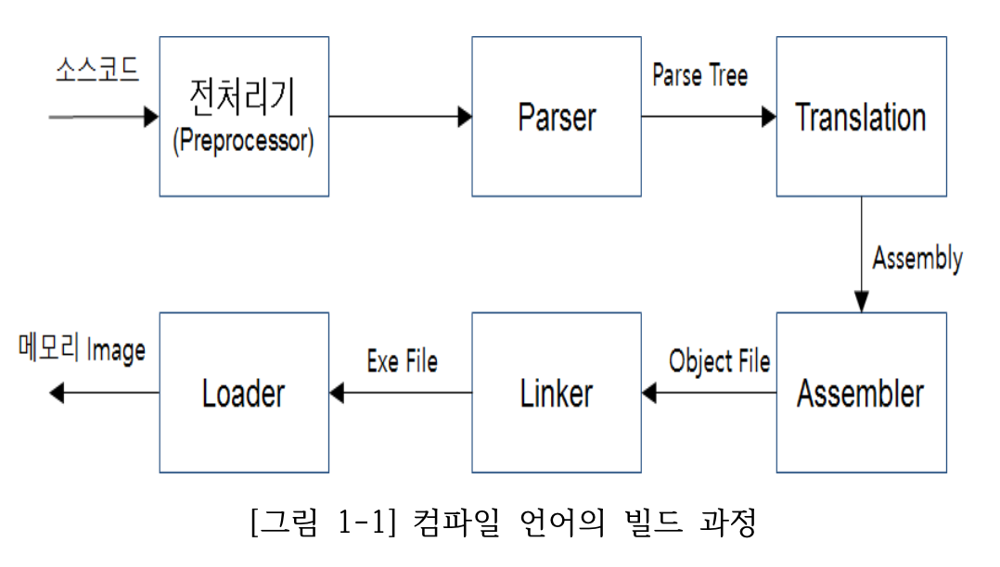
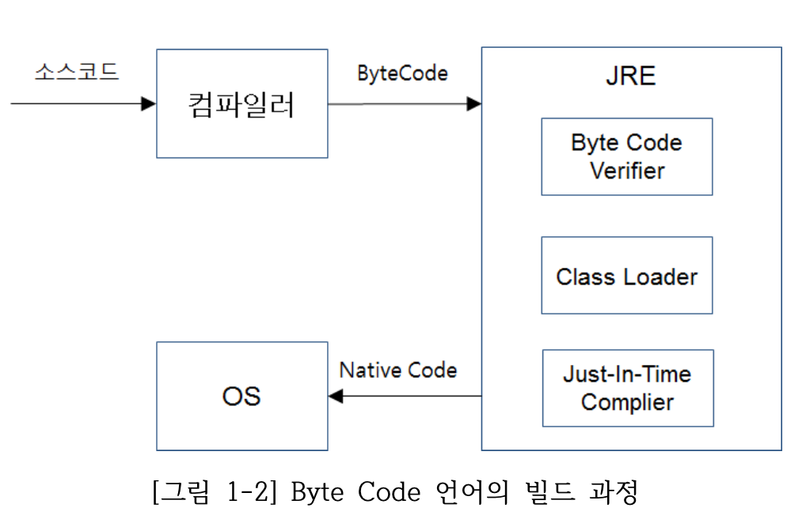
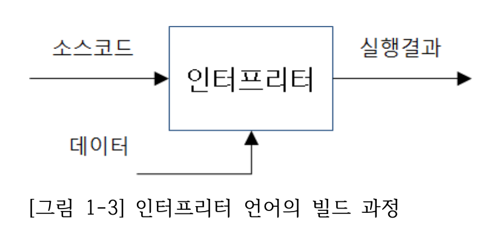
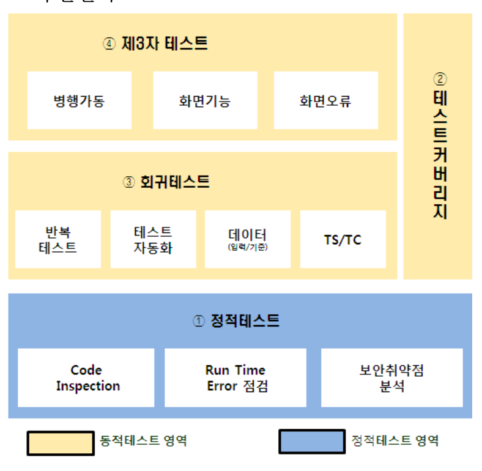

# 애플리케이션 배포

### 1. 컴파일 언어(c,c++ 등)
- 바로 기계어로 바뀌기 때문에 가장 속도가 빠르고 보안에 유리함. but 빌드 과정 오래걸림

### 2. Byte Code 언어(Java, C# 등)
- 빌드 과정 가장 빠름

### 3. 인터프리터 언어(Javascript, Python, Ruby 등)
- 한 줄씩 번역되어 실행. 메모리 소모 작음
 

## 애플리케이션 배포 환경
1. 웹서버
2. WAS
## 애플리케이션 배포 단위
1. jar
2. war
3. ear

## 형성관리 시스탬
> 형상관리시스템은 서비스 제공 대상 형상항목을 식별하여 기준선(Baseline)을 설정하고, 형상항목 변경 과정에서 점검, 검증 등의 체계적인 통제를 통해 형상 항목 간의 일관성과 추적성을 확보하기 위한 시스템이다. 형상관리시스템은 소프트웨어의 개발 및 운영/유지･보수에 필요한 문서 관리, 변경 관리, 버전관리, 배포관리 및 작업 산출물에 대한 형상관리를 포함한다.
1. 형성관리의 범위
- 형상관리 범위는 신규 프로젝트 및 보완 개발, 업무시스템의 운영/유지･보
수, 전산 설비 및 시스템 소프트웨어 등과 관련된 작업, 사용자(EUC: End
User Computing) 파일 관리 등을 포함한다.
2. 형상관리 용어
  1. 형상관리
  2. 형상항목
  3. 기준선
  4. 마이그레이션
  5. 리포지터리
  6, 워크플로
  7. 반출
  8. 반입
## 애플리케이션 소스 검증
 
## 테스트 커버리지
> 테스트 커버리지는 전체 프로그램의 범위 대비 테스트 수행 시 해당 테스트 수행을 위해 동작도니 프로그램의 범위 비율을 말함.
### 텍스트 커버리지 측정 유형
1. 라인 커버리지
2. 분기 커버리지
3. 조건 커버리지

