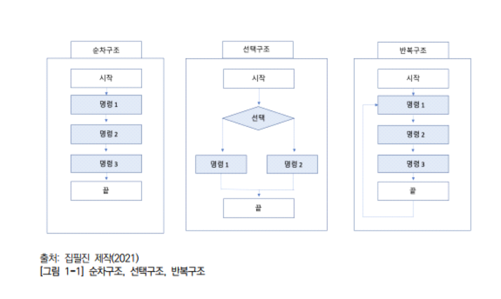

# 프로그래밍 언어 활용

 구조적 프로그래밍 설계 구조 및 절차
구조적 프로그래밍은 구조화 프로그래밍으로도 불리며 절차적 프로그래밍
기반 아래 만들어진 프로그래밍 기법으로 프로그램을 결합하는 순차, 분기,
반복 구조를 통하여 설계된다.

## 1. 구조적 프로그래밍 설계 구조
1. 순차구조
2. 선택구조(if, if-else)
3. 반복구조 (for, while)

## 2. 구조적 프로그래밍 언어 개발 절차
1. 요구사항 분석
요구사항 분석 단계는 고객이 원하는 요구사항을 수집하여 명세화하는 단계이다.
2. 구조적 분석
구조적 분석 단계는 고객이 원하는 기능, 시스템 환경, 데이터를 종합하여 데이터 흐름도(Data Flow Diagram)를 작성하는 단계이다. 시스템이 지원
할 비즈니스 프로세스를 하향식(Top-Down)으로 분할하고 시각적으로 표
현하는 기법이다. 대표적인 기법에는 ERD(Entity Relation Diagram)과
DFD(Data Flow Diagram)가 있다.
3. 구조적 설계
구조적 설계 단계는 모듈 중심으로 설계하는 단계로 재활용, 결합도를 낮
춰 독립성을 높이는 단계이다.
4. 구조적 프로그래밍
구조적 프로그래밍 단계는 순차, 선택, 반복의 논리 구조로 구성하여 프로
그램 복잡성을 최소화하여 프로그래밍 하는 단계이다.
  1. 데이터 흐름도 DFD(Data Flow Diagram)
    - 프로세스
      1) 프로세스는 원과 원안의 이름으로 표현하고, 데이터를 원하는 데이터
      로 변환하여 출력시키기 위한 과정이다.
      2) 원안에 기록하는 이름은 프로세스가 수행하는 프로세스 또는 일을
      수 행하는 행위자를 기술한다.
      3) 프로세스는 항상 입력되는 데이터를 입력할 수 있어야 하며, 자체적
      으로는 데이터를 생성할 수 없다.
      4) 프로세스는 항상 새롭게 개발할 수 있는 가치를 부가해야 한다.
    - 데이터 흐름(Data Flow)
      1) 데이터 흐름은 DFD의 구성요소들 간의 인터페이스를 나타낸다.
      2) 대부분의 데이터 흐름은 프로세스들 사이를 연결하게 되지만, 데이터 저장소로부터 데이터 흐름을 나타내기도 한다.
      3) 데이터 흐름은 부여되지 않은 화살표로 표시하거나 명칭을 부여한다.
      단, 후속 작업들의 참조를 위해 되도록 명칭을 부여하는 것을 권장한다.
      4) 서로 다른 데이터 흐름에는 같은 이름을 부여하지 않는다.
    - 데이터 저장소(Data Store)
      1) 데이터 저장소는 저장되어 있는 정보 집합이다.
      2) 데이터 저장소는 저장되는 저장소 파일 등일 수 있으며, 때로는 휴지
      통일 수도 있다.
      3) 데이터 저장소는 데이터의 변동을 표시하는 것이 아닌 단순한 데이
      터 저장을 나타내는 것이다.
      4) 데이터 흐름을 표시함으로써 데이터의 입출력을 나타낸다.
      5) 데이터 흐름도에서 데이터 저장소를 나타내는 표기법은 두 개의 직
      선인 평행선으로 나타내고, 평행선 안에 데이터 저장소의 명칭을 부여
      한다.
    - 외부 엔티티(External Entity)
      1) 액터는 데이터를 생성, 소비함으로써 데이터 흐름도를 주도하는 활성
      객체이다. 액터는 데이터 흐름도의 입력과 출력에 붙는다. 데이터 흐름
      도의 경계에 놓이게 되며, 소스나 싱크로 데이터의 흐름을 중단시킨다.
      2) 외부 엔티티는 프로세스 처리 과정의 데이터 발생의 시작 및 종료를
      나타낸다.
      3) 외부 엔티티는 데이터 흐름도상에서 프로세스와의 상호관련성을 표
      시하며, DFD 범위 밖에 사각형 형태로 표시한다.
  2. DFD 설계 방법
      1. 업무를 분석하여 프로세스에 대한 입출력 데이터 흐름을
식별한다. 이후 업무의 주변 경계에 그들을 표시한다.
      2. 데이터 흐름에 필요하고 제공되어야 할 외부 엔티티를 정의한다.
      3. 입력으로부터 출력으로나 출력으로부터 입력으로, 중간 지점부터의
데이터 흐름을 식별한다.
      4. 모든 접속 관계 데이터 흐름에 명칭을 부여한다.
      5. 프로세스에 대해 입력 데이터와 출력 데이터 흐름의 명칭에 따라
      이름을 부여한다.
      6. 프로세스에 관련된 데이터 저장소를 정의하고 검토, 보완한다.
      7. 상위 레벨 DFD 작성 후 다음 하위 레벨의 DFD로 분할하여 최하
      위 레벨까지 그린다.
      8. 데이터 흐름도의 규모가 커서 한 장의 종이에 그릴 수 없을 때는
      시스템을 서브 시스템들로 분할한다. 분할된 서브시스템들의 규모가 클
      때는 다시 분할을 계속한다. 세분화를 계속하여 최종 데이터 흐름도를
      단순한 기능들만으로 그릴 수 있는 단계까지 분할한다.
  * 자료사전 DD(Data Dictionary)
  * 상태 전이도 STD(State Transition Diagram)
  * 소단위 명세 Minispec(Mini Specification)

1. 요구사항 분석
2. 구조적 분석
3. 구조적 설계
4. 구조적 프로그래밍
    1. 데이터 흐름도 DFD
        1. 프로세스
        2. 데이터 흐름
        3. 데이터 저장소
    2. 자료사전 DD
    3. 상태전이도 STD
    4. 소단위 명세 MInispec