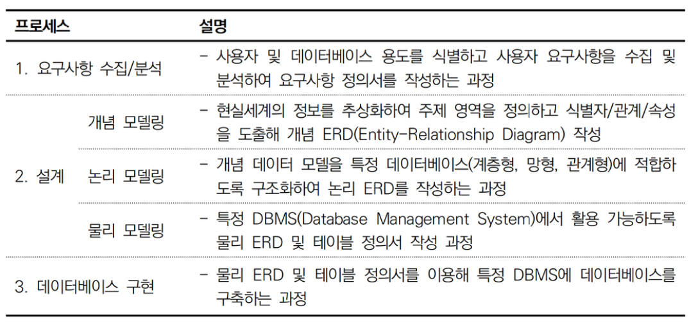

# 응용 sw 기초 기술 활용

# 네트워크 계층 구조
### 1. OSI 7 계층
 

### 2. TCP/IP(Transmission Control Protocol/Internet Protocol) 프로토콜 스택
1. TCP/IP 프로토콜 스택의 개념
- OSI 7 Layer를 실무에 활용하는 기능 중심으로 4계층으로 구조화하고, 각 그룹에서 활용되는 프로토콜군을 정리한 네트워크 통신 구조모델이다.
2. TCP/IP 프로토콜 스택의 구성
- OSI 7 Layer의 1, 2계층과 5, 6, 7계층을 통합하여 4계층으로 구성된다.
 

## 인캡슐레이션
- 송신지 Application Layer에서 발생한 데이터를 하위 계층으로 이동시키면서 각 계층에서 처리한 결과를 캡슐화하는 과정
## 디캡슐레이션
- 수신지의 하위 계층에서 인식한 데이터를 상위 계층으로 이동시키면서 각 네트워크 계층에서 처리 가능한 형태로 디캡슐화 시키는 과정
 
## 2. 인캡슐레이션과 디캡슐레이션의 처리 방법
1. 송신지에서의 인캡슐레이션 처리
```
(가) Transport 계층에서는 상위 Application 계층에서 생성된 메시지를 전송이 용이하도록 분할하여 Body 정보에 추가하고 수신지에서 분할되어 수신된
메시지를 재조립할 수 있도록 전송 순번, 출발지와 도착지의 Port 정보 등
을 Header 정보에 추가하여 Segment를 생성한다.
(나) Network 계층에서는 상위 Transport 계층에서 생성한 Segment를 Body정보에 추가하고 출발지와 도착지의 IP 정보 등을 Header에 추가하여
Packet을 생성한다.
(다) Data Link 계층에서는 상위 Network 계층에서 생성한 Packet을 Body 정보에 추가하고 출발지와 도착지의 MAC 정보 등을 Header에 추가하고 수
신지에서 수신된 데이터가 정상인지 판단할 수 있도록 FCS(Frame Check
Sequence)를 마지막에 추가하여 Frame을 생성한다.
(라) Physical 계층에서는 상위 Data Link 계층에서 생성한 Frame을 물리적인 전기 신호로 부호화하여 수신지에 전송한다.
```
2. 수신지에서의 디캡슐레이션 처리
```
(가) Physical 계층에서 전기 신호를 비트로 복호화하고 Network 계층에 전달한다.
(나) Data Link 계층에서 헤더 정보를 체크하여 목적지의 MAC 주소가 자신의
MAC 주소와 동일하면 이더 타입(Ether Type)에 정의되어 있는 Network
계층의 프로토콜로 헤더를 제거한 Packet을 전달한다.
(다) Network 계층에서 헤더 정보를 체크하여 목적지의 IP 주소가 자신의 IP 주소와 동일하면 프로토콜 번호(Protocol Number)에 정의되어 있는
Transport 계층의 프로토콜로 헤더를 제외한 Segment를 전달한다.
(라) Transport 계층에서 헤더 정보를 체크하여 도착한 Segment들을 재조립하여 Message를 생성하고 포트 번호(Port Number)에 정의된 Application 계층의 프로토콜로 헤더를 제외한 Message를 전달한다.
```
### PDU(Protocol Data Unit)
> PDU는 각 네트워크 계층에서 사용하는 데이터 단위를 의미하는 용어로 통신에 필요한 헤더 정보(제어 정보)와 데이터를 캡슐화하여 구성하며 Frame, Packet, Segment 등 계층별로 다른 단위를 사용한다. 예를 들어 4계층에서는 Segment 단위를 사용하며 송신지와 수신지의 4계층에서는 Segment를 이용해 통신을 수행하게 된다.

 

## 라우팅 유형
1. 정적 라우팅
2. 동적 라우팅
  - 거리 벡터 알고리즘
    - RIP
  - 링크 상태 라우팅 알고리즘
    - ospf

# 미들웨어
> 하나의 시스템에서 다양한 목적의 응용 소프트웨어가 동시에 수행되거나 복수 시스템이 응용소프트웨어가 서로 연계되어 수행되는 경우에도 안정적으로 실행될 수 있도록 운영체제와 응용소프트웨어 사이에서 다양한 기능을 지원하는 소프트웨어
### 미들웨어 주요 기능
 
### 미들웨어 주요 기능별 분류 체계
1. 분산 시스템 소프트웨어
 
2. it 자원 관리
 
3. 서비스 플랫폼

4. 네트워크 보안
 

### 전자정부 표준 프레임워크
> 정부 부처, 지자체, 공공기관 등의 공공정보화사업에서 JAVA 기반 웹/모바일 시스템 구축 시 활용되는 개발프레임워크로 한국지능정보사회진흥원(NIA)의 표준프레임워크센터에서 Apache 2.0 라이선스로 공개하고 있어 일반 기업 및 학습용으로도 활용 가능하다.


## Scouter
> Scouter는 오픈소스 소프트웨어(Apache-2.0 License)로 공개된 애플리케이션 성능 관리(APM: Application Performance Management) 도구로서 응용소프트웨어 엔지니어가 분산 환경에서 안정적으로 시스템을 운영 및 관리하도록 지원하는 미들웨어이다. C/S(Client/Server) 형태가 일반적이지만 플러그인을 이용하면 Web 기반으로도 이용이 가능하며 오픈소스 소프트웨어이므로 학습용으로도 적합하다
### Scouter 구성
- 서버, 클라이언트, 어젠트로 구성

 

# 데이터베이스
> 데이터는 관찰이나 측정으로 수집한 사실을 수치 또는 문자 형태로 표현한 최소 단위 값. DIKW 피라미드와 같이 정보, 지식, 지혜로의 변환을 통한 창조(Creation)적 사고의 근간이 된다.
 
- 데이터베이스는 공용으로 활용하기 위해 통합하여 저장한 운영 데이터의 집합이다.
### 데이터베이스 특징
- 실시간 접근성
  - 요청 받은 데이터는 실시간으로 처리되고 결과를 반환해야 함
- 계속적 변화
  - 저장된 데이터는 입력 수정 삭제에 의해 지속적으로 변화함
- 동시 공용
  - 서로 다른 목적의 응용 sw 및 사용자에 의해 동시 공용 가능
- 내용에 의한 참조
  - 데이터의 참조는 데이터의 주소가 아닌 저장된 값에 의해 처리됨
### 데이터베이스 관리시스템(DBMS: Database Management System)의 개념
> 다수의 응용소프트웨어 및 사용자가 데이터베이스에 접근하여 원활하게 사용할 수 있도록 중간에서 관리해주는 시스템
- 동시성 제어
  - 다수 트랜잭션의 동시 처리로부터 데이터 무결성 확보를 위한 제어 수행
- 회복 관리
  - 시스템 오류 및 장애로 인한 데이터 손실 및 결함의 대응
- 성능 관리
  - 데이터 처리 속도 확보를 위한 실행 계획의 최적화
- 보안 관리
  - 비인가 사용자의 접근 제어 및 중요 정보의 암호화
### 데이터베이스 종류
 

# 트랜잭션
> 트랜잭션은 데이터베이스의 상태를 변화시키기 위한 최소 작업 단위. 한 번에 처리 되어야 하는 질의어(sql)묶음
### 트랜잭션 특징
- 원자성
  - 데이터베이스에 트랜잭션은 모두 반영 되거나 / 전혀 반영되지 않거나
- 일관성
  - 트랜잭션 시작 시점에 참조한 데이터는 종료까지 일관성 유지해야함
- 고립성
  - 동시에 다수 트랜잭션이 처리되는 경우 서로의 연산에 개입하면 안 됨
- 지속성
  - 트랜잭션이 성공적으로 완료되면 처리 결과는 연속적으로 반영되어야 함
### 트랜잭션의 고립화 수준
 

# 관계형 데이터베이스 테이블 정의
## 데이터 모델링
> 시스템으로 구성하기 위한 데이터의 집합(실체)을 도출한 후 각 집합을 구성하는 세부 속성과 식별자를 정의하고 각 데이터 집합 간의 관계를 정해진 표기법(Notation) 으로 시각화하는 과정이다.
- 개념, 논리, 물리
 
## E-R(Entity-Relationship) 데이터 모델
- 현실세계의 구성요소들을 데이터베이스로 관리하기 위해 유형화, 집단화, 일반화 과정을 통해 추상화하여 개체와 관계로 구조화한 데이터 모델
- 개체, 속성, 관계로 구성
 
### 개체 표기법
- 개체는 다른 개체에 의존하지 않고 독립적으로존재 가능한 독립 개체와 독립 개체에 종속되는 종식 개체 존재.
 
### 속성 표기법
- 속성은 반드시 값이 존재해야 하는 필수 속성과 선책 속성이 존재허며 개체에서 하나의 인스턴스를 식별할 수 있는 하나 이상의 속성을 유일식별자 또는 주키라고 함. 또한 다른 개체에서 상속받은 하나 이상의 속성은 외래식별자 또는 외래키라고 한다.

### 관계 표기법
- 관계는 엔티티 간의 상호 연관 규칙을 표현하는 방법으로 하나의 인스턴스가 몇 개의 인스턴스와 연관이 되는지를 관계 기수성으로 표현하고 관계의 필수/선택 여부를 관계 선택성으로 표현하며, 관계로 인스턴스를 식별할 수 있는지 여부를 관계 식별성으로 표현한다.


# SQL
> SQL은 데이터베이스를 조작하기 위한 구조화된 질의어
### 1. DDL(Data Definition Language, 데이터 정의어)
> 데이터를 정의하는 언어로 데이터베이스 스키마 구조를 변경하는 목적으로 데이터베이스 관리자나 설계자가 주로 사용한다.
- create, alter, drop, truncate

### 2. DML(Data Manipulation Language, 데이터 조작어)
> 데이터를 조작하는 언어로 데이터를 조회하거나 입력, 수정, 삭제하기 위한 목적으로 데이터베이스 관리자나 응용소프트웨어 개발자가 주로 사용한다.
- select, insert, update, marge, delete
 
### 3. DCL(Data Control Language, 데이터 제어어)
> 데이터를 제어하는 언어로 데이터베이스 접근을 위한 권한을 부여하거나 회수하는 목적으로 데이터베이스 관리자가 주로 사용한다
- grant, revoke
