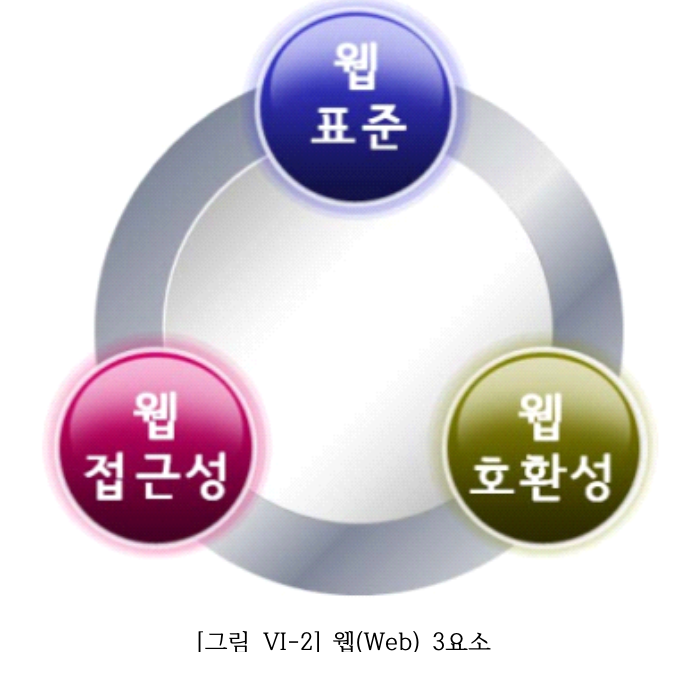
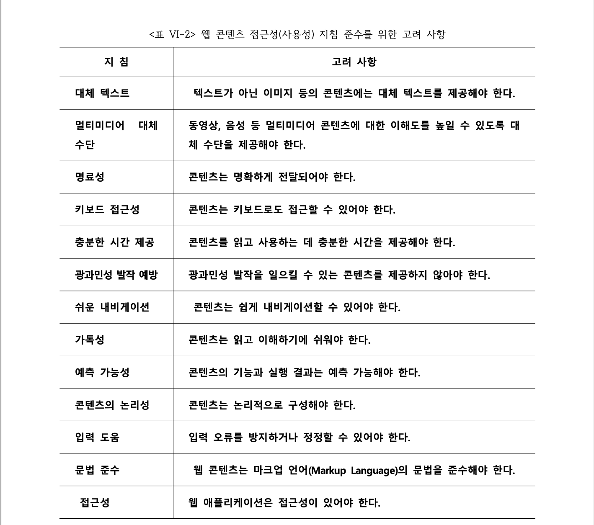
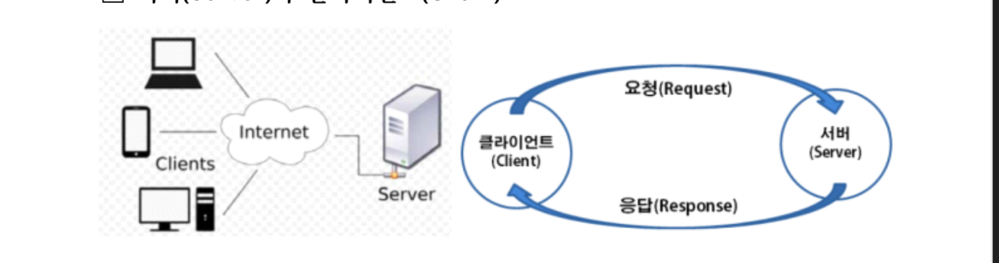
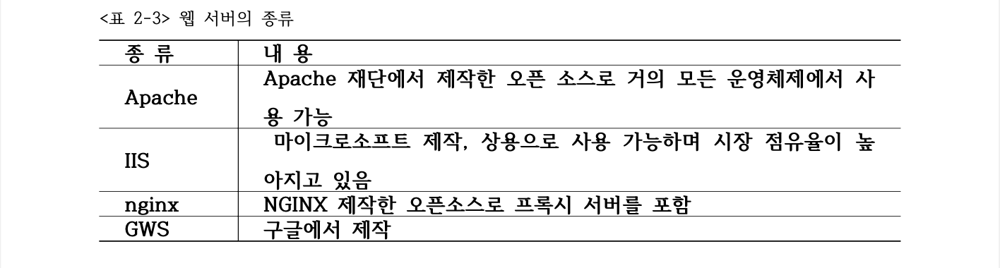
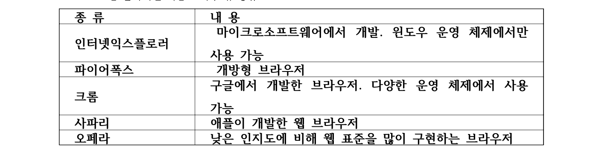
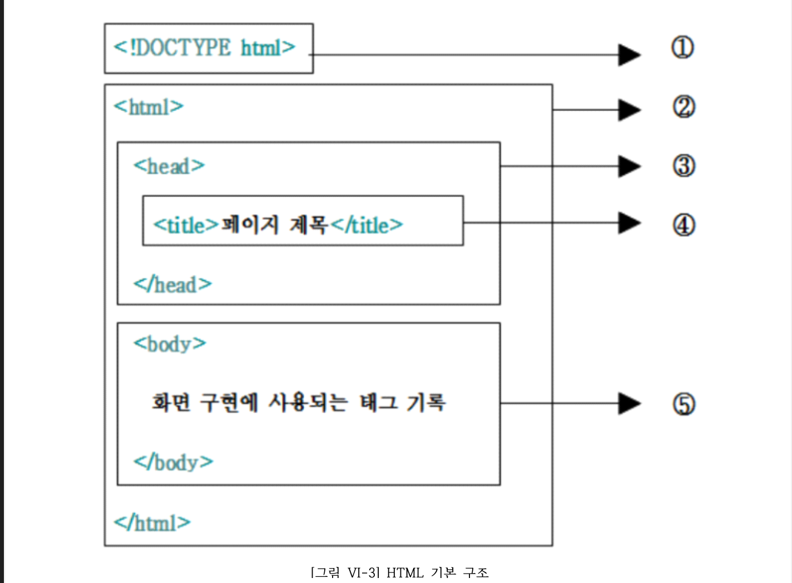
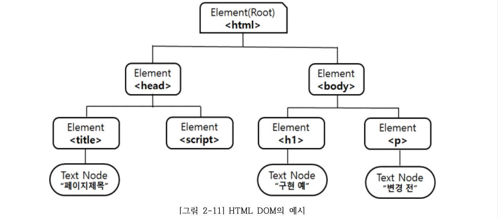

# 화면 구현

# UI
사용자가 하드웨어나 시스템에 연결되는 과정에서 사용자의 편리성과 가독성을 높여주기위한 것.
1. CLI(명령어 라인 인터페이스)
2. GUI(그래픽 유저 인터페이스)
3. NUL(자연어 유저 인터페이스)

## 소프트웨어 아키텍처
- 소프트웨어 구성요소 중 외부에 드러나는 요소 특성과 요소들 간의 관계를 표현한 것
## 제약상황
1. 시스템 설계. 구현 시 관련되는 기술이나 표준, 규정들을 의미함
2. 개발과 관련된 정책이나 업무 규칙, 특정 프로그램 사용, 데이터 사용과 관련된 등 개발 할 때 적용할 업무 영역의 표준이나 법규의 표준 적합 제약사항으로 나눌 수 있다.

### 화면 설계
1. 화면 설계서 유형
  - 파포, 스토리보드, 와이어프레임, 목업 등
2. 프로토타입
3. ui 디자인

## UI 메뉴 구조 확인
1. 사용성
2. 유용성
3. 정보구조
4. 네비게이션
5. 유스 케이스

## UI 구현 지침
1. W3C
2. 한국형 웹 콘텐츠 접근성 지침
3. 전자정부 웹 표준 준수 지침

## 웹 3요소

1. 웹표준
2. 웹 접근성
3. 웹 호환성

# 서버와 클라이언트

1. 서버
  - 클라이언트에게 넷웤 통해 정보나 섭스 제공하는 컴터/프로그램
  - 웹 문서는 클라이언트로부터 http 요청 바아들이고 반환함.

2. 클라이언트
  - 네트워크를 통하여 다른 서버 시스템 상의 컴퓨터에 원격 서비스에 접속 할 수 있는 응용 프로그램이나 서비스를 클라이언트라 함
  - 크롬, 파이어폭스 등
  

## 웹사이트
> 웹 사이트는 인터넷 프로토콜 기반의 네트워크에서 URL을 통하여 보이는 웹 페이지들의 의미 있는 묶음이다.
## 웹 페이지
> 웹 페이지는 월드 와이드 웹(WWW, World Wide Web) 상에 있는 개개의 문서를 의미한다.

## HTML
- 웹 페이지 표현 마크업 언어

## CSS
- 페이지 전체 일관성 유지하기 위해 미리 저장해둔 스타일 시트

## 자바스크립트
- 객체지향언어
- js를 이용하여 웹페이지 이벤트 처리

## DOM
 

## 사용성 테스트 과정 (중요!!!)
1. 계획 수립 - 목적, 평가 내용(항목) 분석, 사용 환경, 사용자 등을 분석한다.
2. 테스트 설계 - 진행 절차 작성, 테스트 참가자 결정, 테스트 항목의
평가 방향 결정, 다양한 평가 방법으로 설계한다.
3. 테스트 실행 – 설계된 진행 절차대로 진행한다.
4. 결과 보고서 작성 – 평가에 사용된 데이터를 분류하고 분석하며 결
과를 통해 문제점을 분석한 후, 수정에 필요한 의견을 포함하여 보고
서를 작성함으로써 피드백을 통해 오류를 수정하도록 한다.