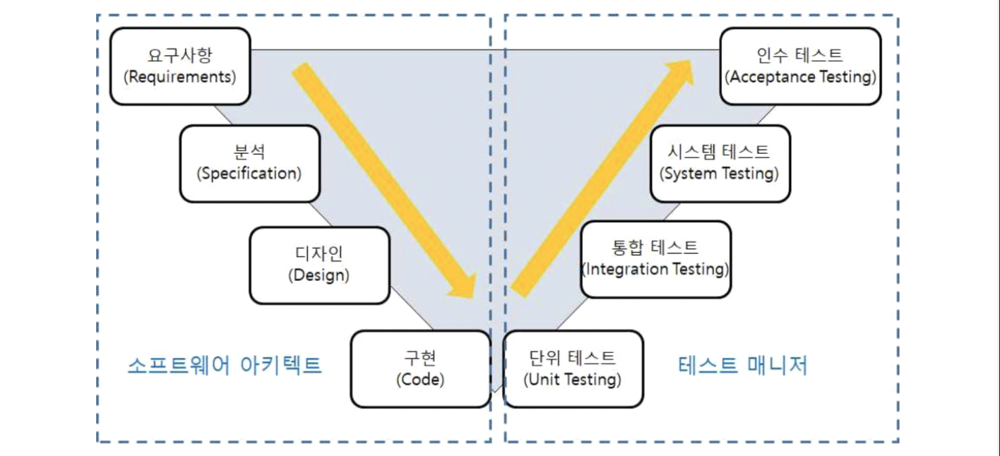
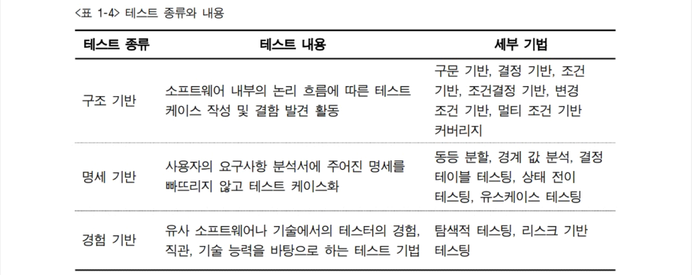
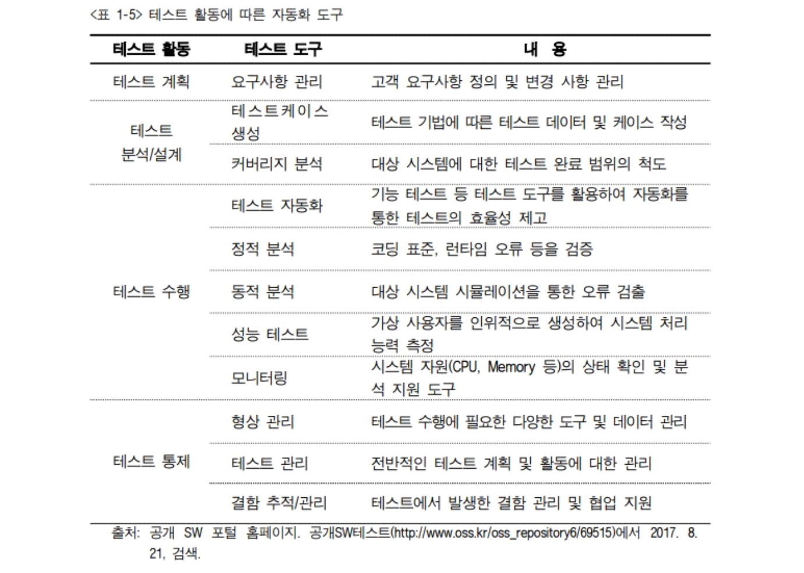
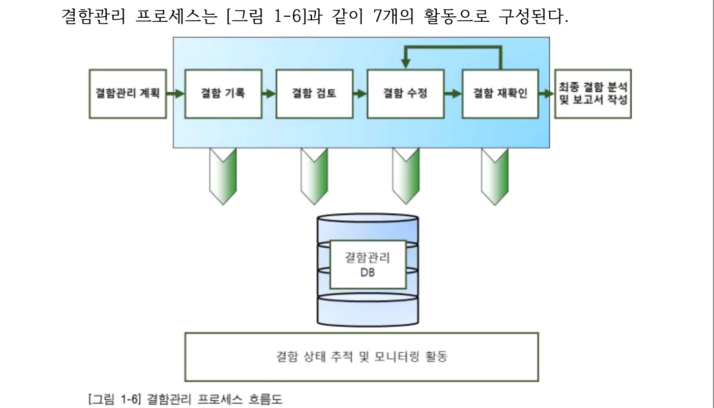
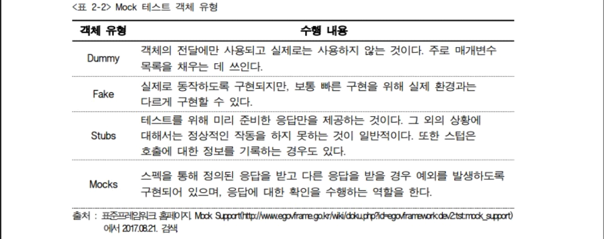
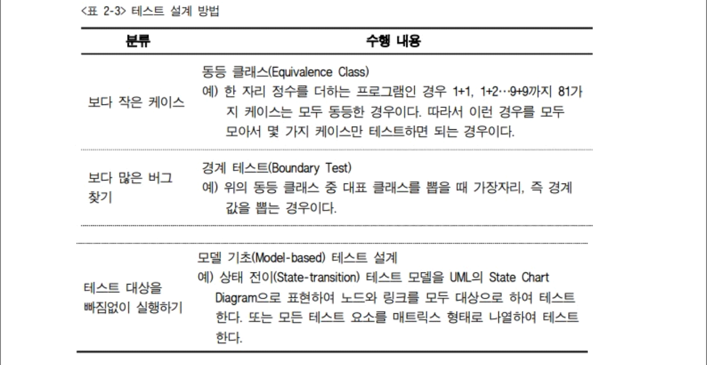
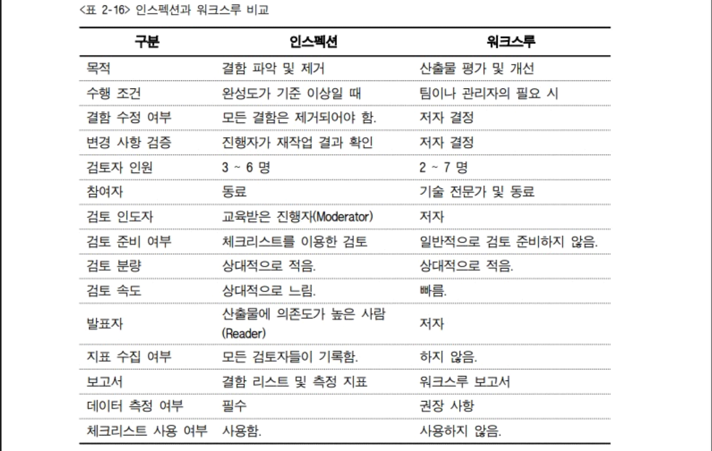

# 애플리케이션 테스트 수행

# 테스트
1. 단위 테스트
  - 작은 소프트웨어 단위 테스트
  - 구조적 테스트, 기능성 테스트, 리소스 관련 테스트, 강건성 테스트 등
2. 통합 테스트
  - 하나의 프로세스가 완성된 경우 부분적으로 통합 테스트 수행
  - 컴포넌트 간 인터페이스 테스트를 하고 운영체제(OS), 파일 시스템, 하드웨어 또는 시스템 간 인터페이스와 같은 각각 다른 부분과 상호 연동이 정상적으로 작동하는지 여부를 테스트
3. 시스템 테스트
  - 통합된 단위 시스템의 기능이 시스템에서 정상적으로 수행되는지 테스트
4. 인수 테스트
  - 최종 사용자와 업무에 따른 이해관계자 등이 테스트를 수행함으로써 개발된 제품에 대해 운영 여부를 결정하는 테스트.

 

# 결함의 정의
1. 결함은 프로그램과 명세서 간의 차이, 업무 내용 불일치이다.
2. 결함은 기대 결과와 실제 관찰 결과 간의 차이이다.
3. 시스템이 사용자가 기대하는 타당한 기대치를 만족시키지 못할 때
변경이 필요한 모든 것은 결함이다.

1. 결함 등록
2. 결함 검토
3. 결함 할당
4. 결함 수정
5. 결함 조치 보류
6. 결함 종료
7. 결함 헤제
## 결함 분류
1. 시스템 결함
  - 비정상적 종료. 중단. 응답시간지연. 디비에러 등
2. 기능 결함
  - 요구사항 불일치, 스크립트 에러 등
3. GUI 결함
  - ui 비일관성, 부정확 커서, 메세지 , 데이터 타입 오류 등
4. 문서 결함
   - 메뉴얼 불일치
## 결함 심각도
1. High
시스템이 중단(또는 다운)되어 더 이상 프로세스를 진행할 수 없게 만드는
결함으로 시스템의 핵심 요구사항 미 구현, 시스템 다운, 장시간 시스템
응답 지연, 시스템 복구 후 데이터 왜곡 등의 경우를 말한다.
2. Medium
시스템의 흐름에 영향을 미치는 결함으로 부정확한 기능, 부정확한 업무
프로세스, 데이터 필드 형식의 오류, 데이터베이스 에러, 보안 관련 오류
등의 경우를 말한다.
3. Low
시스템의 흐름에는 영향을 미치지 않는 결함이나 상황에 맞지 않는 용도와
화면 구성(Configuration) 결함으로, 부정확한 GUI 및 메시지, 에러 시
메시지 미출력, 화면상의 문법/철자 오류 등을 말한다.

# 결함 조치
## 단위 테스트
1. jUnit활용 테스트
2. Mock 테스트
 
## 통합 테스트
1. 테스트 설계 기법
2. 테스트 설계 방법
 
## 시스템 테스트
1. 부하 및 성능 테스트
2. 장애 복구 테스트
3. 보안 테스트
4. 인수 테스트

### 결함 관리 이해
1. 에러
2. 오류
3. 실패
4. 결함

## 결함 판단 기준
(1) 기능 명세서에 가능하다고 명시된 동작을 수행하지 않는 경우
(2) 기능 명세서에 불가능하다고 명시된 동작을 수행하는 경우
(3) 기능 명세서에 명시되어 있지 않은 동작을 수행하는 경우
(4) 기능 명세서에 명시되어 있지 않지만 수행해야 할 동작을 수행하지 않는
경우
(5) 테스터의 시각에서 볼 때 문제가 있다고 판단되는 경우

## 결함 조치 관리
### 1. 프로그램 코드 검토 기법
- 소프트웨어 인스펙션
- 인스펙션을 해야 하는 비즈니스적인 이유는 아래와 같다. 
(가) 결함을 빨리 찾을수록 수정(fix) 비용이 적게 든다.
(나) 인스펙션의 데이터를 통해 업무에 집중할 수 있다.
(다) 인스펙션을 함으로써 교차 교육(Cross-training)을 돕는다.
(라) 제품의 "re-engineering”이 가능한 영역을 식별하도록 돕는다.
(마) 소프트웨어를 개발하고 유지하는 데 적은 비용이 든다.
(바) 스케줄에 긍정적인 효과를 준다.
(사) 품질을 향상시킨다.
- 인스펙션 중점 항목
(1) 자동 코드 인스펙션을 위한 환경 지원, 계획 수립 지원 활동
(2) 체크리스트 정합성 검토 지원 활동
(3) 인스펙션 결과 리뷰 참석
(4) 발견된 결함을 수정하기 위한 개발자 리딩 지원 활동

### 2. 형상 관리 및 구성 요소
1. 소프트웨어 형상 관리의 정의
(1) 소프트웨어 프로세스의 모든 출력물 정보
(2) 컴퓨터 프로그램, 컴퓨터 프로그램 설명 문서, 데이터 등
(3) 소프트웨어 프로세스 전반에 걸쳐 소프트웨어 형상의 변경 요인에 대해
소프트웨어 형상을 보호하는 활동
