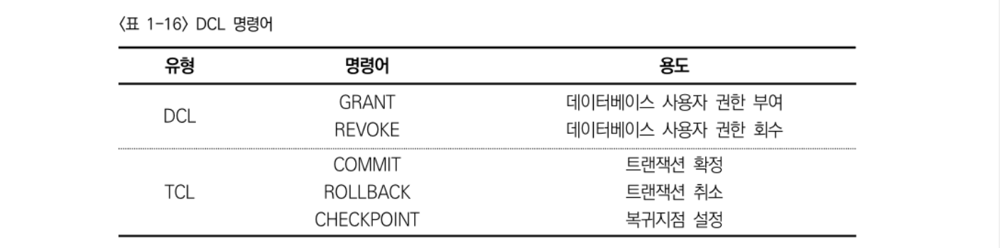

# SQL활용
## 1. DDL 개념
> DDL(Data Definition Language)은 영문 그대로 ‘데이터를 정의하는 언어'이다. 보다 직관적으로 설명하자면 ‘데이터를 담을 그릇을 생성하는 언어'이다. 이렇게 생성한 그릇을 DBMS에서는 오브젝트(Object)라고 한다. 
 
 
### JOIN

### 서브쿼리

### 집합 연산자

## 2. DCL 개념
> 데이터베이스에서 데이터 외의 오브젝트를 조작하려고 하는 경우에 DCL 명령을 사용한다. 이는 Data Control Language라는 약자로, 데이터 제어 언어라고 한다. 다음을 통해 DCL문의 대상과 오브젝트 유형을 확인한다.

## 3. TCL

