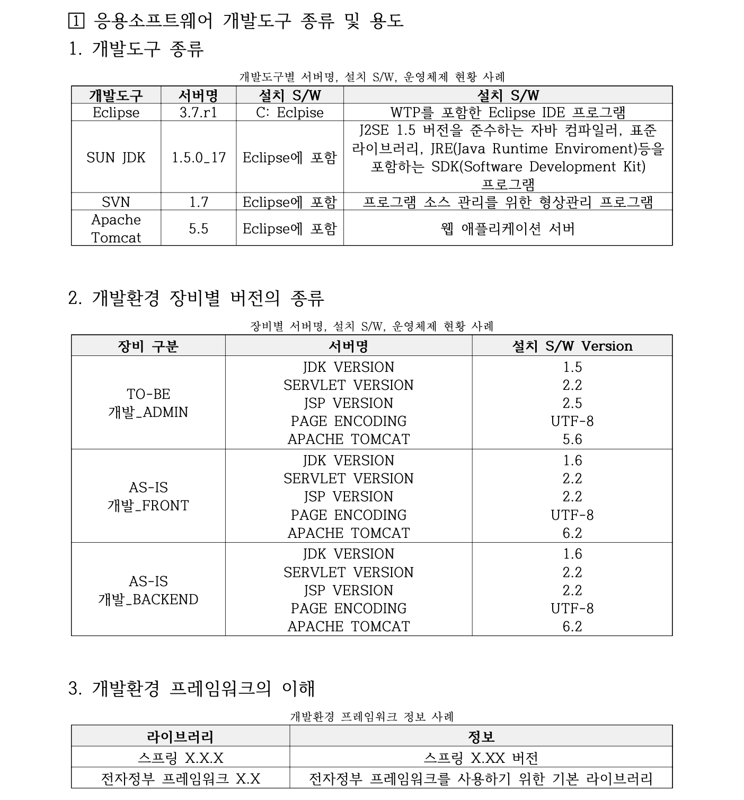
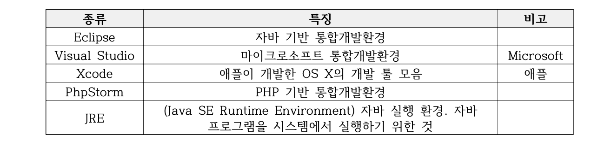
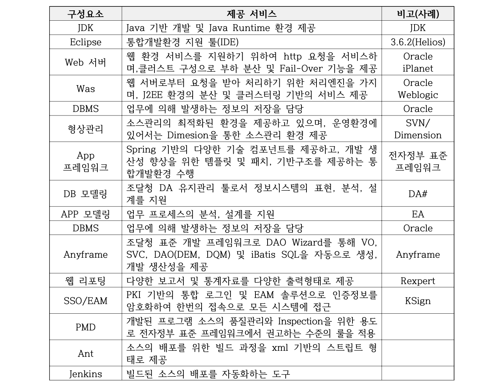

# 개발자 환경 구축

# 운영체제
- 컴퓨터 시스템이 제공하는 핟웨어와 솥웨어 기능을 사용할 수 있도록 해주는 시스템소프트웨어
- 한정된 시스템 자우너을 효율적으로 사용할 수 있도록 관리 및 운영함으로써 사용자에게 편리성 제공
## 1. 운영체제의 주요 기능
(1) 처리능력 향상 : 한정된 시간 내 최대한의 데이터를 처리
(2) 응답시간 단축 : 처리 요청으로 부터 처리 완료까지 소요시간 최소화
(3) 신뢰도 향상 : 시스템 장애의 처리
(4) 컴퓨터 시스템과 사용자 간 인터페이스(Interface) 기능 제공
(5) 출력 역할 지원
(6) 각 프로그램과 사용자 간 보호
(7) 주기억 장치 관리
(8) CPU를 통한 프로그램 실행 관리
(9) 컴퓨터 시스템 내 파일 관리
(10) 컴퓨터 시스템 명령어 해석/수행
## 2. 운영체제의 종류
(1) 윈도즈 OS : Microsoft사 제품으로 유료로 다양한 라이선스 정책이
적용되어 있으며, 주로 중소 규모 및 개인용 PC의 OS로 사용
(2) UNIX : IBM, HP, Sun사의 제품으로 유료로 다양한 라이선스 정책이
적용되며, 주로 대용량 처리, 안전성이 요구되는 서버(Server) 제품군
에 사용
(3) Linux : Linux Torvalds사의 제품으로 무료이며, 중대 규모 서버에 사용
(4) iOS : Apple사 제품으로 하드웨어의 번들(Bundle)이며, 스마트폰 및
태블릿 PC에 사용
(5) Android : Google사 제품으로 무료이며, 스마트폰 및 태블릿 PC에 사용

※ 정보시스템의 운영체제 선정 시 고려해야 할 요소
- 정보시스템 호환성
- 정보시스템 확장성
- 정보시스템 처리율
- 정보시스템 응답시간
- 정보시스템 가용성
- 정보시스템 보안성

## 운영체제 프로세서
### 1. 운영체제의 프로세스의 개념
(1) CPU를 통해 수행되는 사용자 및 시스템 프로그램
(2) 시스템의 작업 단위
### 2. 운영체제의 프로세스의 특징
(1) 현재 실행 중이거나 곧 실행이 가능한 프로그램
(2) 운영체제 내에 PCB를 가진 프로그램
(3) 목적 또는 결과에 따라 발생하는 사건들의 과정
(4) 프로세스는 병행 수행 가능
(5) CPU는 수시로 프로세스들 사이를 다중화하여 전환
(6) 지정된 결과를 얻기 위한 계통적 동작
(7) 비동기적 행위(Asynchronous Activity)
(8) 프로세스가 할당하는 개체(Entity)로서 디스패치(Dispatch) 가능

## 운영체제 프로세스 종류
### 1. 순차 프로세스
(1) 한 프로세스의 수행이 순차적인 방법으로 진행
(2) 어느 한순간에 많아야 하나의 명령어만 프로세스를 대표하여 수행하게 됨
(3) 현재 실행 중인 하나의 프로그램으로 프로세스가 포함하고 있는 내용
(가) 프로세스 문맥 : 상태 워드나 레지스터들
(나) 기억장치 문맥 : 데이터 세그먼트, 코드 세그먼트, 실행 스택 등
(다) 프로세스와 연관된 속성들
1) 프로세스 이름 : 프로세스가 생성될 때 할당된 내부 번호
2) 우선순위 : CPU를 할당하는 스케쥴링에 사용
3) 권한 : 정보 보호 및 수행할 연산을 지정
### 2. 병행 프로세스
(1) 병행 프로세스의 개념
(가) 프로그램 그 자체가 프로세스는 아님
(나) 하나의 프로그램 = 수동적(Passive)인 단위
(다) 하나의 프로세스 = 능동적(Active)인 단위
(2) 병행 프로세스의 형태
 

---
## 상태(State)
(1) 컴퓨터 시스템 내에 하나의 프로세스가 존재하는 동안 그 프로세스는
계속해서 여러 사건들에 의해 일련의 상태 변화를 거침
(2) 구분 : 제출(Submit) 상태, 보류(Hold) 상태, 준비(Ready) 상태, 실행
(Running) 상태, 대기(Waiting) 상태, 완료(Complete) 상태
## 준비 리스트(Ready List)와 대기 리스트(Waiting List)
(1) 준비 리스트 : 우선순위를 부여하여 가장 높은 우선순위를 갖는 프로
세스가 다음 순서에 CPU를 할당받음
(2) 대기 리스트 : 우선순위가 존재하지 않음

※ 애플리케이션 작업 우선순위 선정 시 고려해야 할 요소
- 시스템 자원 여유율 확인(CPU, 메모리)
- 우선순위 설정 후 시스템 상태 정보 확인
- 자원 효율성을 고려한 우선순의 명령어 사용법 숙지

※ 운영체제 설치 시 고려해야 할 요소
- 상용 운영체제인 경우 라이선스 및 수량 확인
- 개발통합환경(IDE)과의 호환성
- 운영체제 EOS(End of Service) 여부
- 운영체제 설치 후 취약점 점검 항목에 따른 조치
- 운영체제 최신 패치 여부 확인

# 응용소프트웨어 개발도구 종류 및 용도

※ 개발도구 설치 시 고려해야 할 요소
- 개발도구와 운영체제의 호환성 및 충돌 여부
- 개발도구 버전 확인
- 상용 S/W 경우 라이선스 수량 확인
- 개발도구 보안성을 고려한 최신 패치 여부
## 개발도구
### 1. 통합개발환경(IDE) : ‘Integrated Development Environment’의 약자로
개발을 하면서 사용하는 도구들의 집합
(1) 통합개발환경의 지원 기능 : 언어팩, 개발 편집기, Git 연동, Syntax
Highlighting, 기타 플러그인
(2) 통합개발환경의 종류

### 2. 개발 도구의 종류
 
※ 개발환경에서 개발도구 활용 시 고려해야 할 요소
- 개발 프로그램의 계정 관리(1인 1계정 사용)
- 로컬 PC환경과 개발환경 호환성 및 인터페이스 여부
- 개발환경 개발도구 데이터 백업 관리
- 개발환경 및 운영환경의 분리
- 개발 서버 및 운영 서버의 접근 통제