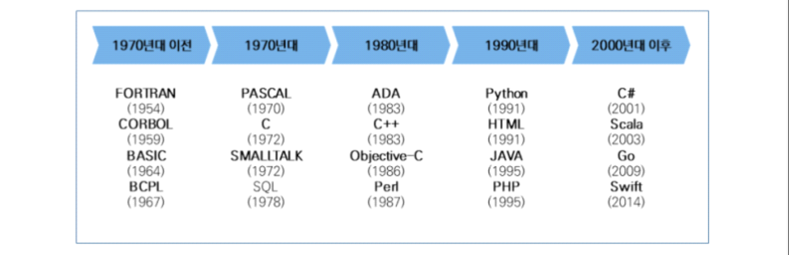
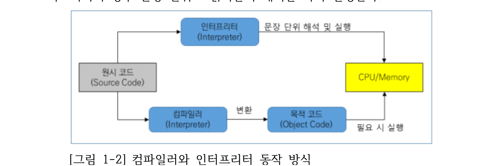
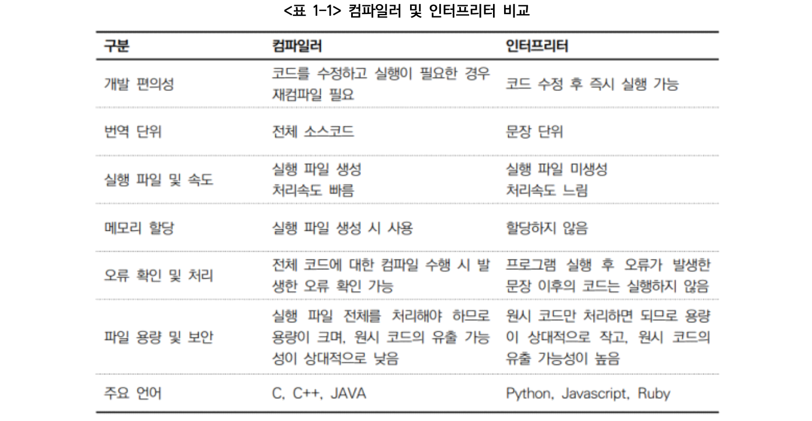

# 9. 프로그래밍 언어 응용

## 1. 프로그래밍 언어의 발전 과정

## 2. 프로그래밍 언어의 유형 분류
### (1) 개발 편의성 측면에 따른 분류
(가) 저급언어(Low-Level Language): 컴퓨터가 직접 이해할 수 있는 언어
로 실행속도는 빠르나 기계마다 기계어가 상이하여 호환성이 없고 유지관리
가 어렵다.
(나) 고급언어(High-Level Language): 개발자가 이해할 수 있도록 소스코
드를 작성할 수 있는 언어로, 실행을 위해서는 번역 과정이 필요하다.
### (2) 실행 및 구현 방식에 따른 분류
(가) 명령형 언어(Imperative Language): 컴퓨터가 동작해야 할 알고리즘
을 통해 프로그래밍의 상태를 변경시키는 구문에 중점을 둔 방식으로
FORTRAN, C 등이 속한다.
(나) 함수형 언어(Functional Language): 함수의 응용을 강조하면서 자료의
처리는 수학적인 함수의 연산으로 취급하고, 상태와 가변 데이터는 멀리하
는 방식으로 LISP, Scala 등이 속한다.
(다) 논리형 언어(Logic Language): 논리 문장을 이용하여 프로그램을 표현하고
조건이 만족되면 연관된 규칙이 실행되는 방식으로 PROLOG 등이 속한다.
(라) 객체지향언어(Object-Oriented Language): 객체 간의 메시지 통신을
이용하여 동작하는 방식으로 JAVA, C++ 등이 속한다.
(3) 빌드(Build) 방식에 따른 분류
프로그램의 소스코드가 실행 가능한 형태로 변하는 과정을 빌드(Build)라고
하며 빌드 방식에 따라 분류할 수 있다.
(가) 컴파일 언어(Compile Language): 소스코드가 기계어 실행 파일로 빌
드되는 방식이다. C, C++ 등이 속하며 실행속도가 높은 특징이 있다.
(나) 인터프리터 언어(Interpreter Language): 소스코드를 한 줄씩 번역하
여 실행하는 방식이다. Python 등이 속하고 실시간 실행 및 분석이 가능한
특징이 있다.
(다) 바이트 코드 언어(Byte Code Language): 컴파일을 통해 가상머신이
번역할 수 있는 Byte Code로 변환되며, 가상머신은 다시 Native OS가 이
해할 수 있는 기계어로 번역하는 방식이다. JAVA, Scala 등이 속한다.
## 컴파일러(Compiler)와 인터프리터(Interpreter)
고급언어로 작성한 소스코드의 경우 컴퓨터가 이해할 수 없으므로 컴파일러나 인터프리터를 이용하여 컴퓨터가 이해하고 실행할 수 있는 기계어 코드로 번역을 수행한다.

